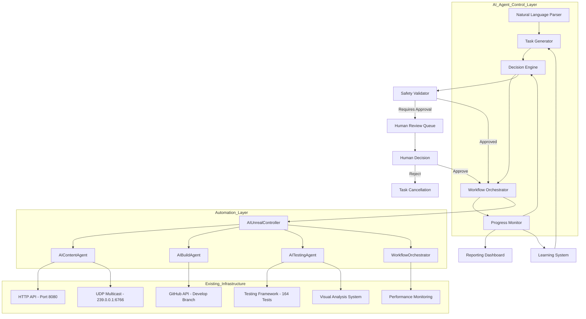
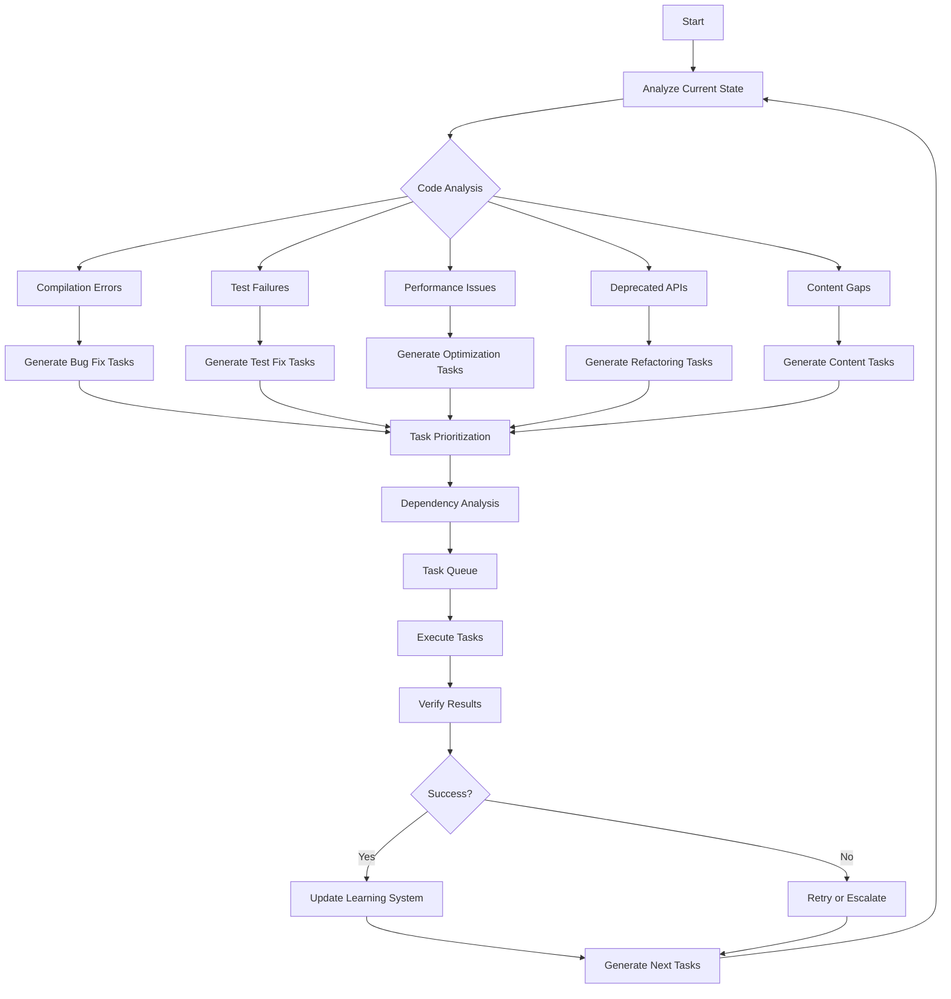
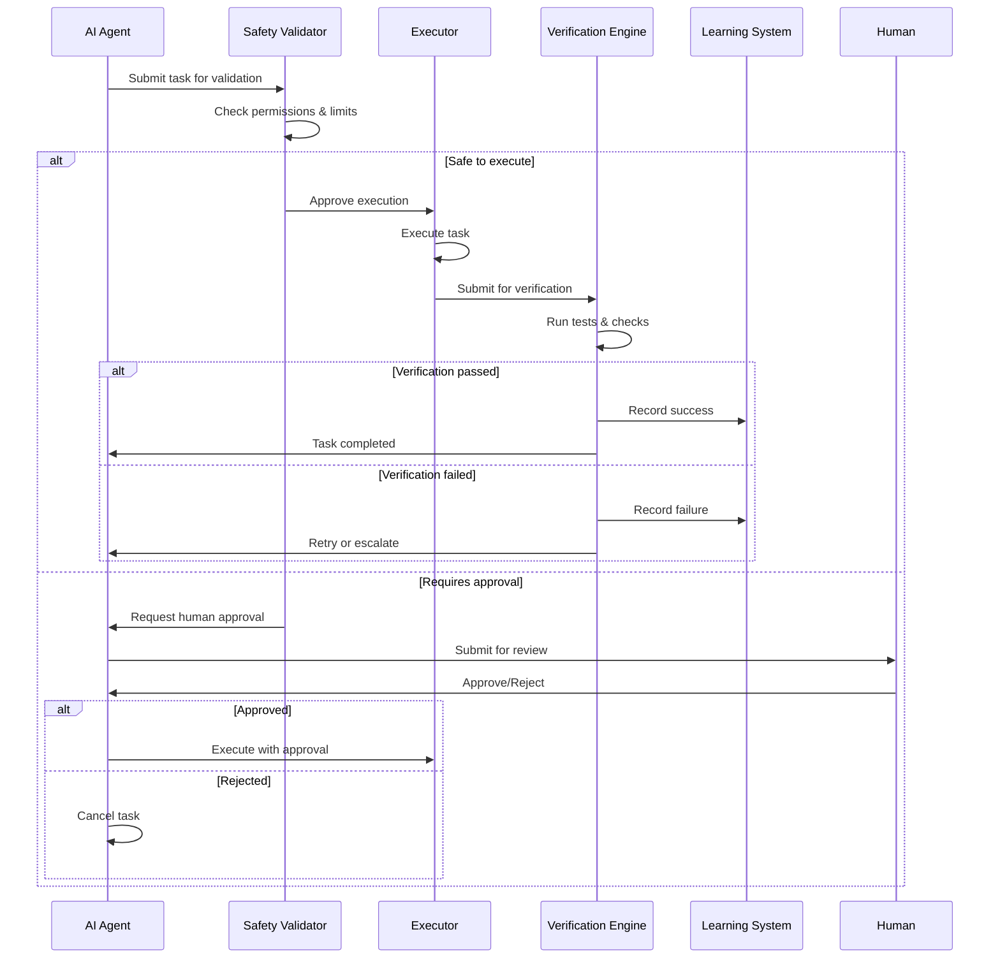

# AI Agent Autonomous Development Plan - Alexander Project

**Version**: 1.0  
**Date**: November 11, 2025  
**Status**: Architecture & Planning Phase  
**Autonomy Level**: Level 3 (with Level 4 aspirations)

---

## Executive Summary

This plan enables AI agents to autonomously control the development process for the Alexander VR space simulation project. The system leverages 4,000+ lines of existing Python automation, 24 completed autonomous iterations, and mature infrastructure to create a self-improving development ecosystem.

**Key Objectives**:
- Enable AI agents to autonomously decide, execute, and verify development tasks
- Achieve 95% task completion rate with 100% compilation success
- Reduce manual development time by 50% within 3 months
- Progress to 80% autonomous operation within 6 months

---

## 1. System Architecture

### 1.1 High-Level Architecture



### 1.2 Component Specifications

#### AI Agent Control Layer

**Natural Language Parser**
- **Purpose**: Parse development goals and requirements from natural language
- **Input**: Text descriptions of desired features, bug reports, performance issues
- **Output**: Structured task definitions with priority, complexity, and dependencies
- **Integration**: Uses existing `ai_agents.py` and `ai_workflow_orchestrator.py` patterns

**Task Generator**
- **Purpose**: Generate specific, actionable development tasks
- **Capabilities**:
  - Analyze current codebase state
  - Identify compilation errors, warnings, and deprecated APIs
  - Generate tasks for bug fixes, optimizations, and content creation
  - Prioritize tasks based on impact and dependencies
- **Output**: JSON task definitions with execution parameters

**Decision Engine**
- **Purpose**: Make autonomous decisions about task execution
- **Decision Matrix**:
  - **Safe Tasks** (Auto-execute): Build verification, testing, asset optimization
  - **Medium-Risk** (Assisted): Content creation, performance optimization
  - **High-Risk** (Human approval): Core gameplay changes, API modifications, deployment
- **Learning**: Improves decision accuracy based on historical success rates

**Workflow Orchestrator**
- **Purpose**: Coordinate execution of complex multi-step workflows
- **Integration**: Extends existing `WorkflowOrchestrator` class
- **Capabilities**:
  - Parallel task execution
  - Dependency management
  - Error recovery and retry logic
  - Progress tracking and reporting

**Progress Monitor**
- **Purpose**: Monitor task execution and system health
- **Metrics**: Success rate, execution time, resource usage, error patterns
- **Integration**: Feeds data to Learning System for continuous improvement

**Safety Validator**
- **Purpose**: Enforce safety boundaries and validation rules
- **Checks**:
  - File modification permissions (read-only for critical systems)
  - Resource limits (30 min execution, 8GB memory)
  - Code quality gates (compilation, tests, performance)
  - Deployment restrictions (dev/staging only, manual prod approval)

#### Integration with Existing Infrastructure

**HTTP API Integration (Port 8080)**
- **Current**: `automation_http_client.py` provides ship control and state queries
- **Enhanced**: Add endpoints for task execution, progress reporting, and system control
- **Security**: Rate limiting, authentication, request validation

**UDP Multicast Integration (239.0.0.1:6766)**
- **Current**: Remote execution capabilities
- **Enhanced**: Real-time status broadcasting, distributed task coordination
- **Use Cases**: Multi-agent collaboration, progress notifications

**Visual Analysis System**
- **Current**: Screenshot capture and analysis via AI Vision plugin
- **Enhanced**: Automated visual regression testing, UI validation, performance visualization
- **Integration**: Feed visual verification results back to Decision Engine

**GitHub API Integration**
- **Current**: Develop branch management
- **Enhanced**: Automated commits, pull requests, branch management, conflict resolution
- **Safety**: Require human approval for merges to main/release branches

**Performance Monitoring**
- **Current**: FPS, memory, and hardware tracking
- **Enhanced**: Automated performance regression detection, optimization suggestions
- **Integration**: Performance gates in CI/CD pipeline

**Testing Framework**
- **Current**: 164 test cases across 7 test stations
- **Enhanced**: Automated test generation, intelligent test selection, failure analysis
- **Integration**: Test results feed into Learning System and Decision Engine

---

## 2. Autonomous Development Workflow

### 2.1 Task Generation Workflow



### 2.2 Decision-Making Framework

**Task Classification Matrix**

| Task Type | Auto-Execute | Assisted | Human Approval | Examples |
|-----------|--------------|----------|----------------|----------|
| **Build Verification** | ✅ | - | - | Compilation checks, project file generation |
| **Testing** | ✅ | - | - | Unit tests, smoke tests, regression tests |
| **Asset Optimization** | ✅ | - | - | LOD generation, texture compression, cleanup |
| **Content Organization** | - | ✅ | - | Asset reorganization, naming conventions |
| **Performance Optimization** | - | ✅ | - | Profiling, optimization suggestions |
| **Content Creation** | - | ✅ | - | Level creation, mission generation |
| **Bug Fixes (Low Risk)** | - | ✅ | - | API updates, minor logic fixes |
| **Bug Fixes (High Risk)** | - | - | ✅ | Core gameplay fixes, physics changes |
| **API Changes** | - | - | ✅ | Interface modifications, breaking changes |
| **Deployment** | - | - | ✅ | Production deployment, release tagging |
| **File Deletion** | - | - | ✅ | Asset deletion, system removal |

**Decision Rules**

1. **Compilation Errors**: Auto-generate and execute fix tasks
2. **Test Failures**: Auto-generate tasks, assisted execution for complex fixes
3. **Performance Regressions**: Auto-generate optimization tasks, human approval for major changes
4. **New Features**: Human approval required for scope and design
5. **Content Creation**: Assisted autonomy with human validation
6. **Deployment**: Human approval required for all production deployments

### 2.3 Verification and Validation Workflow



---

## 3. Implementation Phases

### Phase 1: Basic AI Control (Weeks 1-4)

**Objective**: Establish foundational AI control over existing automation

**Deliverables**:
- AI Agent Control Layer with basic task execution
- Integration with existing HTTP API and testing framework
- Simple decision-making for safe tasks
- Basic progress monitoring and reporting

**Key Tasks**:
1. Create `ai_autonomous_controller.py` - Main autonomous controller
2. Extend `ai_workflow_orchestrator.py` with autonomous capabilities
3. Implement basic task generation from compilation errors
4. Add safety validation layer
5. Create progress monitoring dashboard
6. Integrate with existing build_and_test.py

**Success Criteria**:
- ✅ AI can automatically fix compilation errors
- ✅ AI can run and verify test suites autonomously
- ✅ 90% success rate for safe tasks (build, test, optimization)
- ✅ Basic reporting and logging functional

**Risk Level**: LOW - Uses existing proven automation

### Phase 2: Enhanced Decision-Making (Weeks 5-8)

**Objective**: Implement intelligent task generation and priority assessment

**Deliverables**:
- Natural language task parser
- Intelligent task prioritization system
- Enhanced decision engine with learning capabilities
- Performance regression detection
- Automated optimization suggestions

**Key Tasks**:
1. Implement natural language parser for development goals
2. Create task prioritization algorithm based on impact/effort
3. Add performance monitoring and regression detection
4. Implement learning system for decision improvement
5. Create optimization workflow automation
6. Add content creation assistance capabilities

**Success Criteria**:
- ✅ AI can parse natural language development goals
- ✅ Intelligent task prioritization with 85% accuracy
- ✅ Performance regression automatically detected and addressed
- ✅ 50% reduction in manual task creation

**Risk Level**: MEDIUM - New AI decision-making components

### Phase 3: Full Autonomous Development Loops (Weeks 9-12)

**Objective**: Enable complete autonomous development cycles

**Deliverables**:
- Self-directed task generation and execution
- Continuous integration and deployment automation
- Advanced error recovery and retry logic
- Multi-agent collaboration system
- Comprehensive reporting and analytics

**Key Tasks**:
1. Implement autonomous task generation from system analysis
2. Create CI/CD pipeline integration
3. Add advanced error recovery and self-healing
4. Implement multi-agent coordination for complex tasks
5. Create comprehensive analytics dashboard
6. Add automated deployment to staging environments

**Success Criteria**:
- ✅ AI can run complete development cycles without human intervention
- ✅ 95% task completion rate for autonomous operations
- ✅ Successful automated deployments to staging
- ✅ 75% reduction in manual development time

**Risk Level**: MEDIUM-HIGH - Complex autonomous operations

### Phase 4: Self-Improving Autonomous System (Weeks 13-16)

**Objective**: Create self-improving AI that learns from experience

**Deliverables**:
- Machine learning models for task prediction
- Automated code quality improvement
- Self-optimizing workflows
- Predictive maintenance and bug prevention
- Autonomous system architecture evolution

**Key Tasks**:
1. Implement ML models for failure prediction
2. Create automated code quality improvement system
3. Add workflow optimization based on historical data
4. Implement predictive maintenance for systems
5. Create autonomous architecture evolution capabilities
6. Add advanced natural language understanding

**Success Criteria**:
- ✅ ML models predict failures with 90% accuracy
- ✅ Automated code quality improvements implemented
- ✅ 80% autonomous operation achieved
- ✅ System demonstrates continuous improvement

**Risk Level**: HIGH - Advanced AI/ML components

---

## 4. Safety and Validation Mechanisms

### 4.1 Safety Boundaries

**File System Restrictions**
```
READ-WRITE ACCESS:
- automation/* (all automation scripts)
- Source/Alexander/Private/* (implementation files)
- Content/* (game content)
- Config/* (configuration files)
- Saved/AI_Reports/* (reports and logs)

READ-ONLY ACCESS:
- Source/Alexander/Public/* (header files - require approval)
- Plugins/*/Source/* (plugin sources - require approval)
- *.uproject (project file - require approval)
- Build configuration files (require approval)

NO ACCESS:
- Engine installation directory
- System files
- User documents
- Network shares
```

**Resource Limits**
- **Execution Time**: 30 minutes per task (configurable)
- **Memory Usage**: 8GB maximum per process
- **Disk Space**: 10GB maximum for temporary files
- **Network**: Rate limited to 60 requests/second
- **CPU**: 4 cores maximum per task

**Human Approval Requirements**
1. **File Deletion**: Any asset or source file deletion
2. **API Changes**: Interface modifications, breaking changes
3. **Core Systems**: Changes to physics, rendering, gameplay core
4. **Deployment**: All production deployments
5. **Resource Increases**: Exceeding standard resource limits
6. **New Dependencies**: Adding external libraries or plugins
7. **Configuration Changes**: Critical system configuration modifications

### 4.2 Validation Procedures

**Pre-Execution Validation**
1. **Permission Check**: Verify file access permissions
2. **Resource Check**: Ensure resources available
3. **Dependency Check**: Verify all dependencies met
4. **Safety Check**: Validate against safety rules
5. **Approval Check**: Confirm human approval if required

**Post-Execution Validation**
1. **Compilation Check**: Verify code compiles successfully
2. **Test Check**: Run relevant test suite
3. **Performance Check**: Verify no performance regression
4. **Integration Check**: Verify system integration intact
5. **Visual Check**: Run visual regression tests if applicable

**Continuous Monitoring**
- Real-time progress tracking
- Resource usage monitoring
- Error pattern detection
- Performance metric collection
- Automated alerting on anomalies

### 4.3 Rollback Capabilities

**Automatic Rollback Triggers**
- Compilation failure after changes
- Test pass rate drops below 90%
- Performance regression >10%
- Critical system errors
- Human approval timeout
- Resource limit exceeded

**Rollback Procedures**
1. **Git Revert**: Automatic git revert of changes
2. **Backup Restore**: Restore from pre-change backup
3. **System Reset**: Reset to last known good state
4. **Human Escalation**: Escalate to human developer
5. **Incident Report**: Generate detailed failure report

---

## 5. Integration Points

### 5.1 Existing Infrastructure Integration

**HTTP API Server (Port 8080)**
```python
# Enhanced endpoints for autonomous control
POST /api/autonomous/task           # Submit autonomous task
GET  /api/autonomous/status/{id}    # Get task status
POST /api/autonomous/approve/{id}   # Approve pending task
GET  /api/autonomous/dashboard      # Get status dashboard
POST /api/autonomous/shutdown       # Emergency shutdown
```

**UDP Multicast System (239.0.0.1:6766)**
```python
# Real-time status broadcasting
{
    "message_type": "task_update",
    "task_id": "auto_fix_001",
    "status": "in_progress",
    "progress": 45,
    "estimated_completion": "2025-11-11T03:00:00Z"
}
```

**Visual Analysis System**
- Automated screenshot capture for visual verification
- Visual regression detection and reporting
- UI state validation and consistency checks
- Performance visualization and analysis

**GitHub Integration**
```python
# Automated branch management
- Auto-create feature branches for tasks
- Automated commits with descriptive messages
- Pull request generation with change summaries
- Merge conflict detection and resolution assistance
```

**Performance Monitoring**
- Real-time FPS, memory, and hardware monitoring
- Automated performance regression detection
- Optimization suggestion generation
- Performance trend analysis and reporting

### 5.2 New Integration Components

**Learning System**
- Collects data from all autonomous operations
- Analyzes success/failure patterns
- Generates improvement suggestions
- Updates decision models based on experience

**Reporting Dashboard**
- Real-time task execution status
- Success rates and performance metrics
- Resource usage and system health
- Historical trends and analytics

**Human Review Interface**
- Web-based interface for task approval
- Detailed change summaries and impact analysis
- One-click approve/reject functionality
- Comment and feedback system

---

## 6. Success Metrics and KPIs

### 6.1 Task Execution Metrics

| Metric | Phase 1 Target | Phase 2 Target | Phase 3 Target | Phase 4 Target |
|--------|----------------|----------------|----------------|----------------|
| **Task Completion Rate** | 90% | 93% | 95% | 97% |
| **Compilation Success Rate** | 100% | 100% | 100% | 100% |
| **Test Pass Rate** | 85% | 90% | 95% | 98% |
| **Average Execution Time** | <25 min | <20 min | <15 min | <10 min |
| **Autonomous Task Ratio** | 60% | 75% | 85% | 95% |

### 6.2 Development Velocity Metrics

| Metric | Baseline | 3 Month Target | 6 Month Target |
|--------|----------|----------------|----------------|
| **Manual Development Time** | 100% | 50% reduction | 75% reduction |
| **Tasks per Week** | 10 (manual) | 25 (mixed) | 50 (autonomous) |
| **Bug Fix Time** | 2 hours avg | 30 min avg | 15 min avg |
| **Feature Implementation** | 1 week avg | 3 days avg | 1 day avg |

### 6.3 System Quality Metrics

| Metric | Target | Measurement Method |
|--------|--------|-------------------|
| **Code Quality Score** | >90% | Static analysis + peer review |
| **Performance Baseline** | No regression | Automated performance tests |
| **System Uptime** | >99% | Monitoring and alerting |
| **Rollback Rate** | <5% | Incident tracking |
| **Human Intervention** | <20% | Task escalation tracking |

### 6.4 Learning and Improvement Metrics

| Metric | Phase 2 | Phase 3 | Phase 4 |
|--------|---------|---------|---------|
| **Decision Accuracy** | 80% | 90% | 95% |
| **Failure Prediction** | - | 75% | 90% |
| **Optimization Suggestions** | 60% accepted | 80% accepted | 90% accepted |
| **Workflow Efficiency** | +25% | +50% | +100% |

---

## 7. Risk Management

### 7.1 Identified Risks

| Risk | Probability | Impact | Mitigation |
|------|-------------|--------|------------|
| **AI makes breaking changes** | Medium | High | Safety validator + human approval gates |
| **System enters infinite loop** | Low | Medium | Execution time limits + monitoring |
| **Resource exhaustion** | Low | Medium | Resource limits + automatic cleanup |
| **Data loss** | Very Low | High | Git-based rollback + regular backups |
| **Security vulnerability** | Low | High | Sandboxed execution + permission restrictions |
| **Performance degradation** | Medium | Medium | Performance gates + automated rollback |
| **Human skill atrophy** | Medium | Low | Training + gradual autonomy increase |

### 7.2 Contingency Plans

**System Failure Response**
1. Immediate shutdown of autonomous operations
2. Automatic rollback to last known good state
3. Human notification with detailed failure report
4. Root cause analysis and prevention measures
5. Gradual re-enablement with enhanced safeguards

**Performance Emergency**
1. Automatic performance test execution
2. Comparison with baseline metrics
3. Automatic rollback if regression >10%
4. Performance bottleneck identification
5. Optimization task generation and execution

**Security Incident**
1. Immediate isolation of affected systems
2. Audit log analysis and impact assessment
3. Security patch application
4. Enhanced monitoring implementation
5. Security review and policy updates

---

## 8. Implementation Roadmap

### Phase 1: Foundation (Weeks 1-4)
- **Week 1**: Core controller implementation, safety validator
- **Week 2**: Basic task generation, integration with existing automation
- **Week 3**: Progress monitoring, reporting dashboard
- **Week 4**: Testing, refinement, documentation

### Phase 2: Intelligence (Weeks 5-8)
- **Week 5**: Natural language parser, task prioritization
- **Week 6**: Performance monitoring, regression detection
- **Week 7**: Learning system, decision improvement
- **Week 8**: Optimization automation, content assistance

### Phase 3: Autonomy (Weeks 9-12)
- **Week 9**: Self-directed task generation, CI/CD integration
- **Week 10**: Advanced error recovery, multi-agent coordination
- **Week 11**: Comprehensive analytics, staging deployment
- **Week 12**: Full system integration, performance optimization

### Phase 4: Evolution (Weeks 13-16)
- **Week 13**: ML model implementation, failure prediction
- **Week 14**: Automated code quality improvement
- **Week 15**: Self-optimizing workflows, predictive maintenance
- **Week 16**: Architecture evolution, advanced NLU

---

## 9. Resource Requirements

### 9.1 Development Resources

| Resource | Phase 1 | Phase 2 | Phase 3 | Phase 4 |
|----------|---------|---------|---------|---------|
| **AI Developer** | 1 FTE | 1 FTE | 1 FTE | 1 FTE |
| **Unreal Developer** | 0.5 FTE | 0.5 FTE | 0.25 FTE | 0.25 FTE |
| **DevOps Engineer** | 0.25 FTE | 0.5 FTE | 1 FTE | 0.5 FTE |
| **Total Person-Months** | 7 | 8 | 7.5 | 7 |

### 9.2 Infrastructure Requirements

- **Compute**: 32GB RAM, 8-core CPU for AI operations
- **Storage**: 500GB SSD for project, logs, and backups
- **Network**: Stable internet for GitHub integration
- **Software**: Python 3.11+, Unreal Engine 5.6, Git

### 9.3 Budget Estimate

| Item | Cost | Notes |
|------|------|-------|
| **Development** | $120,000 | 4 months @ $30k/month |
| **Infrastructure** | $5,000 | Hardware and software |
| **Contingency** | $25,000 | 20% buffer |
| **Total** | **$150,000** | |

---

## 10. Conclusion

This AI Agent Autonomous Development Plan provides a comprehensive roadmap for enabling AI-driven development of the Alexander project. By leveraging existing mature infrastructure and implementing a phased approach with strong safety mechanisms, we can achieve significant improvements in development velocity while maintaining high quality standards.

The plan balances innovation with safety, providing clear boundaries for autonomous operation while enabling continuous learning and improvement. With proper implementation, this system will transform the development process, allowing human developers to focus on creative and strategic tasks while AI handles routine development and maintenance.

**Next Steps**:
1. Review and approve this plan
2. Begin Phase 1 implementation
3. Establish monitoring and reporting infrastructure
4. Create detailed technical specifications for each component
5. Set up development and testing environments

---

**Document Version History**:
- v1.0 (2025-11-11): Initial comprehensive plan

**Approval Status**: Pending Review  
**Planned Start Date**: TBD  
**Estimated Completion**: 16 weeks (4 months)