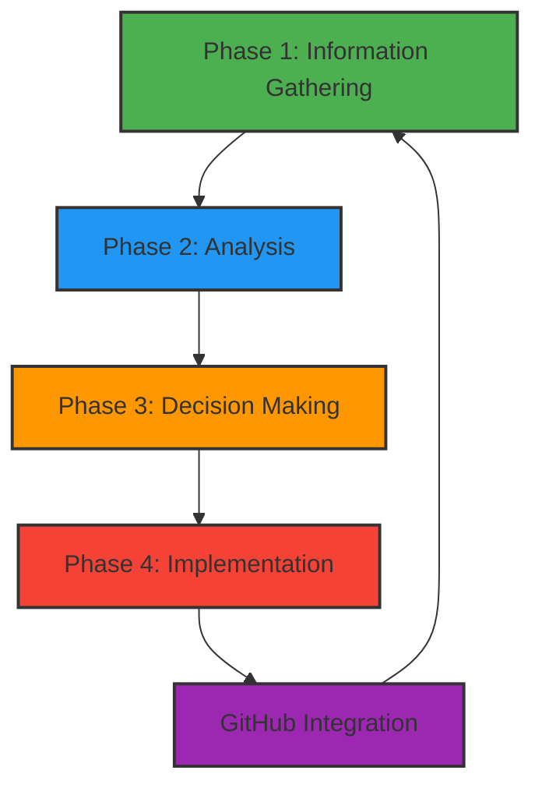
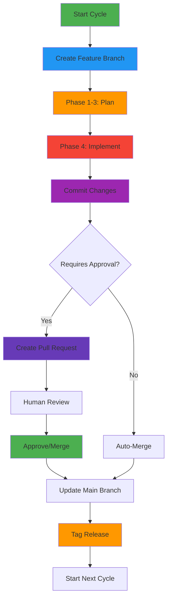

# Autonomous Development Methodology
## Alexander VR Space Simulation - AI-Driven Development

**Version**: 1.1  
**Date**: November 11, 2025  
**Status**: Active Implementation  
**Core Principle**: 4-Phase Iterative Cycles with GitHub Integration

---

## Executive Summary

This document defines the **correct autonomous development methodology** where AI acts as both Analysis Engine and Decision Engine, implementing a 4-phase iterative cycle that repeats continuously until project goals are achieved, with integrated GitHub version control and collaboration workflows.

### The 4-Phase Cycle with GitHub Integration



**Each cycle produces working, tested code improvements, manages version control, and feeds learnings into the next cycle.**

---

## Phase 1: Information Gathering

### Core Principle
**Tests ONLY collect data. They do NOT make decisions or attempt fixes.**

### What Happens
1. Execute appropriate test/collector based on current project state
2. Capture all relevant information (compilation errors, runtime logs, performance metrics, etc.)
3. Save structured data in JSON format
4. Return control to AI for analysis

### Information Gatherers Available
- **Compilation Error Collector** - Captures build errors/warnings
- **Runtime Log Collector** - Captures UE runtime logs
- **Performance Metrics Collector** - Captures FPS, memory, frame time
- **Gameplay Data Collector** - Captures mission completion, player behavior
- **Asset Validation Collector** - Checks for missing/broken assets
- **Visual State Collector** - Captures screenshots and UI state

### Output Format
Each collector produces standardized JSON:
```json
{
  "collector_type": "compilation_errors",
  "timestamp": "2025-11-11T18:00:00Z",
  "results": {
    "success": false,
    "errors": [...],
    "warnings": [...]
  }
}
```

### Success Criteria
- ✅ Information successfully gathered from Unreal Engine
- ✅ Data saved in structured JSON format
- ✅ No automatic fix attempts made
- ✅ Control returned to AI for analysis

---

## Phase 2: Analysis

### Core Principle
**AI analyzes gathered data to identify patterns and root causes. Does NOT decide what to fix yet.**

### What Happens
1. AI reads the JSON output from Phase 1
2. Identifies error patterns and root causes
3. Groups related issues
4. Calculates impact and scope
5. Documents findings for decision phase

### Analysis Types
- **Error Pattern Analysis** - Categorize compilation/runtime errors
- **Performance Bottleneck Detection** - Identify slow functions, memory leaks
- **Code Quality Analysis** - Find code smells, anti-patterns
- **Gameplay Balance Analysis** - Detect difficulty imbalances
- **Asset Issue Analysis** - Identify missing/broken content

### Output Format
```json
{
  "analysis_id": "ANALYSIS-001",
  "phase": "2",
  "timestamp": "2025-11-11T18:01:00Z",
  "findings": [
    {
      "issue_id": "ERR-001",
      "type": "blueprint_specifier_on_private",
      "severity": "critical",
      "affected_files": ["PerformanceMonitor.h", "TestScenarioManager.h", ...],
      "root_cause": "BlueprintReadOnly/BlueprintReadWrite used on private members",
      "impact": "Compilation failure - 24 errors across 6 files",
      "confidence": 0.98
    }
  ]
}
```

### Success Criteria
- ✅ Root causes clearly identified
- ✅ Issues properly categorized
- ✅ Impact and scope calculated
- ✅ Findings documented in structured format

---

## Phase 3: Decision Making

### Core Principle
**AI makes intelligent decisions about WHAT to fix, HOW to fix it, and in WHAT order.**

### What Happens
1. AI reviews analysis findings
2. Calculates priority scores using weighted formula
3. Selects fix strategies for each issue
4. Determines execution order
5. Identifies any requiring human approval
6. Creates implementation plan

### Priority Scoring Formula
```
Priority Score = (Severity × Impact × Confidence) / (Effort × Risk)

Severity Weights:
- Critical: 10 (blocks compilation/launch)
- High: 7 (major gameplay issues)
- Medium: 4 (minor bugs/balance)
- Low: 2 (cosmetic/optimization)

Impact: Number of affected systems/players
Confidence: Analysis confidence (0.0-1.0)
Effort: Estimated fix time (1-10 scale)
Risk: Chance of breaking something (0.0-1.0)
```

### Decision Matrix

| Issue Type | Auto-Fix | Assisted | Human Approval | Examples |
|------------|----------|----------|----------------|----------|
| **Missing Include** | ✅ | - | - | Add `#include "Header.h"` |
| **Invalid Specifier** | ✅ | - | - | Remove invalid UPROPERTY |
| **Deprecated API** | ✅ | - | - | Replace `OldFunc()` with `NewFunc()` |
| **Simple Syntax** | ✅ | - | - | Add missing semicolon |
| **Test Assertion** | ✅ | - | - | Update expected value |
| **Memory Leak** | - | ✅ | - | Add `delete` or smart pointer |
| **Logic Bug** | - | ✅ | - | Fix algorithm, bounds check |
| **Balance Tweak** | - | ✅ | - | Adjust damage/health values |
| **Asset Missing** | - | ✅ | - | Create placeholder |
| **Architecture Change** | - | - | ✅ | Refactor class hierarchy |
| **API Breaking** | - | - | ✅ | Change function signatures |
| **Deployment** | - | - | ✅ | Production releases |

### Output Format
```json
{
  "decision_id": "DECISION-001",
  "phase": "3",
  "timestamp": "2025-11-11T18:02:00Z",
  "decisions": [
    {
      "decision_id": "DEC-001",
      "issue_id": "ERR-001",
      "priority_score": 95.2,
      "rank": 1,
      "decision": "auto_fix",
      "fix_type": "remove_invalid_specifier",
      "files": [
        "Source/Alexander/Public/PerformanceMonitor.h",
        "Source/Alexander/Public/TestScenarioManager.h",
        "Source/Alexander/Public/ErrorDetector.h",
        "Source/Alexander/Public/GameLauncher.h",
        "Source/Alexander/Public/VisualAnalyzer.h",
        "Source/Alexander/Public/OrbitalMechanicsManager.h"
      ],
      "action": "Remove BlueprintReadOnly/BlueprintReadWrite from private members",
      "estimated_effort_minutes": 20,
      "risk_score": 0.05,
      "confidence": 0.98,
      "requires_approval": false,
      "rollback_plan": "Revert git commit"
    }
  ]
}
```

### Success Criteria
- ✅ Priority scores calculated for all issues
- ✅ Fix strategies selected appropriately
- ✅ Execution order determined
- ✅ Human approval requirements identified
- ✅ Implementation plan created

---

## Phase 4: Implementation

### Core Principle
**AI implements the decisions from Phase 3. Does NOT make new decisions.**

### What Happens
1. AI creates GitHub branch for the changes
2. Creates backups of files to be modified
3. Applies code changes according to implementation plan
4. Validates changes (syntax check, compilation test)
5. Commits changes to git
6. Creates pull request for human review (if required)
7. Runs verification build/test
8. Logs results for learning system

### Implementation Process
```python
def implement_fixes(decisions):
    # 1. Create GitHub branch
    branch_name = create_github_branch(decisions)
    
    for decision in decisions:
        # 2. Create backup
        backup_file = create_backup(decision.file)
        
        # 3. Apply changes
        success = apply_code_changes(decision)
        
        if success:
            # 4. Validate
            if validate_changes(decision):
                # 5. Stage changes
                git_add(decision.file)
            else:
                rollback(backup_file)
                return False
        else:
            log_failure(decision)
            return False
    
    # 6. Commit changes
    commit_hash = git_commit(decisions)
    
    # 7. Create pull request if needed
    if requires_human_approval(decisions):
        pr_url = create_pull_request(branch_name, decisions)
        wait_for_approval(pr_url)
    
    # 8. Verify
    verification_result = run_verification()
    
    # 9. Log
    log_implementation(decisions, verification_result, commit_hash)
    
    # 10. Merge if auto-approved
    if not requires_human_approval(decisions):
        merge_pull_request(branch_name)
    
    return True
```

### Output Format
```json
{
  "implementation_id": "IMP-001",
  "phase": "4",
  "timestamp": "2025-11-11T18:03:00Z",
  "decision_id": "DEC-001",
  "github_branch": "fix/blueprint-specifiers-20251111",
  "github_commit": "abc123def456",
  "pull_request_url": "https://github.com/user/repo/pull/42",
  "results": {
    "files_modified": 6,
    "backup_created": true,
    "validation_passed": true,
    "verification_passed": true,
    "status": "completed"
  }
}
```

### Success Criteria
- ✅ All planned changes implemented
- ✅ GitHub branch created
- ✅ Backups created before modifications
- ✅ Changes validated and verified
- ✅ Git commit created
- ✅ Pull request created (if needed)
- ✅ Results logged for learning

---

## GitHub Integration

### Core Principle
**Each development cycle is tracked in version control with appropriate branching, commits, and pull requests.**

### GitHub Workflow Integration



### Branch Naming Convention
```
fix/compilation-errors-20251111
fix/blueprint-specifiers-cycle1
feature/performance-optimization-cycle3
refactor/memory-management-cycle5
```

### Commit Message Format
```
[CYCLE-1] Fix: Remove invalid Blueprint specifiers from private members

- Fixed 24 compilation errors across 6 header files
- Removed BlueprintReadOnly/BlueprintReadWrite from private UPROPERTY declarations
- Moved UENUM to global scope in OrbitalMechanicsManager.h
- All changes validated and build verified

Priority Score: 95.2/100
Risk: Very Low
Files Modified: 6
```

### Pull Request Creation

**For Auto-Approved Changes**:
- Branch is created and committed
- Changes are automatically merged to main
- No PR created (fast-track process)

**For Human-Approved Changes**:
- Branch is created and committed
- Pull request is created with:
  - Clear title: `[CYCLE-N] Description of changes`
  - Detailed description of what was changed and why
  - Impact analysis
  - Verification results
  - Risk assessment
- Assigned to appropriate reviewer
- AI monitors PR status and merges when approved

### Pull Request Template
```markdown
## Autonomous Development Cycle N

### Summary
[Brief description of changes]

### Changes Made
- File 1: What changed
- File 2: What changed
- ...

### Analysis
- Root cause: [Description]
- Impact: [Scope of issue]
- Confidence: [X%]

### Decision
- Priority Score: [X.X/100]
- Fix Strategy: [Auto/Assisted/Human]
- Risk: [Low/Medium/High]

### Verification
- Build Status: [Success/Failed]
- Tests Passed: [X/Y]
- Performance Impact: [None/Improved/Degraded]

### Review Checklist
- [ ] Code changes look correct
- [ ] No logic modifications (if applicable)
- [ ] Performance acceptable
- [ ] Ready to merge

**AI Confidence**: [High/Medium/Low]
**Recommendation**: [Approve/Request Changes]
```

### Merge Strategies

**Auto-Merge** (for low-risk changes):
```python
def auto_merge(branch_name):
    # Checkout main
    git_checkout("main")
    
    # Merge feature branch
    git_merge(branch_name, "--no-ff")
    
    # Push to remote
    git_push("origin", "main")
    
    # Delete feature branch
    git_delete_branch(branch_name)
    
    # Create tag
    git_tag(f"cycle-{cycle_number}-{timestamp}")
```

**PR Merge** (for high-risk changes):
```python
def pr_merge(branch_name, pr_url):
    # Wait for human approval
    approval = wait_for_pr_approval(pr_url)
    
    if approval:
        # Merge via GitHub API
        github_merge_pr(pr_url, merge_method="squash")
        
        # Delete branch
        github_delete_branch(branch_name)
        
        # Pull latest main
        git_pull("origin", "main")
        
        # Create tag
        git_tag(f"cycle-{cycle_number}-{timestamp}")
    else:
        # Handle rejection
        log_rejection(pr_url)
        # Optionally revert changes
        git_revert_branch(branch_name)
```

### GitHub API Integration

**Branch Management**:
```python
def create_github_branch(decisions):
    """Create a new GitHub branch for the cycle"""
    
    # Generate branch name
    cycle_num = get_next_cycle_number()
    issue_type = decisions[0].fix_type
    timestamp = datetime.now().strftime("%Y%m%d")
    branch_name = f"{issue_type}/cycle-{cycle_num}-{timestamp}"
    
    # Get current main SHA
    main_sha = github_get_ref("heads/main")["object"]["sha"]
    
    # Create new branch
    github_create_ref(f"heads/{branch_name}", main_sha)
    
    # Checkout branch locally
    git_checkout(branch_name)
    
    return branch_name

def create_pull_request(branch_name, decisions):
    """Create a pull request for human review"""
    
    pr_data = {
        "title": f"[CYCLE-{get_cycle_number()}] {decisions[0].description}",
        "body": generate_pr_description(decisions),
        "head": branch_name,
        "base": "main",
        "draft": False
    }
    
    response = github_create_pull_request(pr_data)
    return response["html_url"]
```

### Tagging and Releases

**Cycle Tags**:
```bash
git tag -a cycle-1-blueprint-fixes-20251111 -m "Cycle 1: Fixed blueprint specifiers on private members"
git tag -a cycle-2-name-conflicts-20251111 -m "Cycle 2: Resolved 8 type name conflicts"
git tag -a cycle-3-performance-20251112 -m "Cycle 3: Optimized performance bottlenecks"
```

**Release Creation**:
- After N successful cycles, create a release
- Release notes auto-generated from cycle summaries
- Semantic versioning based on changes (major/minor/patch)

### Learning from GitHub Data

**Track Metrics**:
- PR approval time
- Review comments count
- Rejection rate by change type
- Merge conflict frequency

**Improve Decisions**:
```python
def analyze_github_history():
    """Analyze past PRs to improve future decisions"""
    
    # Get merged PRs
    merged_prs = github_get_merged_pull_requests()
    
    for pr in merged_prs:
        # Extract cycle data
        cycle_info = parse_pr_title(pr.title)
        
        # Analyze approval time
        approval_time = calculate_approval_time(pr)
        
        # Count review comments
        review_comments = len(pr.review_comments)
        
        # Check for post-merge issues
        post_merge_fixes = check_for_follow_up_prs(pr)
        
        # Log learning data
        learning_system.log_github_metrics(
            cycle_info=cycle_info,
            approval_time=approval_time,
            review_comments=review_comments,
            post_merge_fixes=post_merge_fixes
        )
```

---

## The Iterative Cycle with GitHub

### Cycle Completion
One complete cycle = Phase 1 → Phase 2 → Phase 3 → Phase 4 → GitHub Integration

### Cycle Outcomes
Each cycle produces:
1. **Working code improvements** - Actual fixes implemented and verified
2. **Version control history** - Branches, commits, PRs, tags
3. **Learning data** - What worked, what didn't, how long it took
4. **Updated project state** - Fewer errors, better performance, etc.
5. **Next cycle plan** - Based on new information gathered

### Cycle Repetition
After GitHub Integration completes:
1. Return to Phase 1 with updated project state
2. Gather new information (there will be less errors now)
3. Analyze any remaining issues
4. Make decisions for next fixes
5. Implement next set of improvements
6. Repeat until project goals achieved

```mermaid
graph LR
    subgraph Cycle_1
        P1A[Phase 1<br/>Gather] --> P2A[Phase 2<br/>Analyze]
        P2A --> P3A[Phase 3<br/>Decide]
        P3A --> P4A[Phase 4<br/>Implement]
        P4A --> GHA[GitHub<br/>Branch & PR]
    end
    
    GHA --> P1B[Phase 1<br/>Gather]
    
    subgraph Cycle_2
        P1B --> P2B[Phase 2<br/>Analyze]
        P2B --> P3B[Phase 3<br/>Decide]
        P3B --> P4B[Phase 4<br/>Implement]
        P4B --> GHB[GitHub<br/>Branch & PR]
    end
    
    GHB --> P1C[Phase 1<br/>Gather]
    
    subgraph Cycle_N
        P1C --> P2C[Phase 2<br/>Analyze]
        P2C --> P3C[Phase 3<br/>Decide]
        P3C --> P4C[Phase 4<br/>Implement]
        P4C --> GHC[GitHub<br/>Branch & PR]
    end
    
    style P1A fill:#4CAF50
    style P2A fill:#2196F3
    style P3A fill:#FF9800
    style P4A fill:#F44336
    style GHA fill:#9C27B0
    style P1B fill:#4CAF50
    style P2B fill:#2196F3
    style P3B fill:#FF9800
    style P4B fill:#F44336
    style GHB fill:#9C27B0
```



---

## Current Implementation Status

### Cycle 1: Compilation Error Fixes
**Status**: Phase 3 Complete, Ready for Phase 4

**Phase 1 - Information Gathered**:
- 24 compilation errors across 6 header files
- All errors: Blueprint specifiers on private members
- 1 additional error: UENUM scope issue

**Phase 2 - Analysis Complete**:
- Root cause: Invalid use of UPROPERTY specifiers
- Impact: Complete compilation failure
- Confidence: 98%

**Phase 3 - Decisions Made**:
- **Priority Score**: 95.2/100 (Critical)
- **Fix Strategy**: Remove invalid specifiers from private members
- **Risk**: Very Low (metadata only)
- **Approval**: Auto-approved
- **Files to Modify**: 6 header files
- **Estimated Time**: 20 minutes

**Phase 4 - Implementation Ready**:
- GitHub branch: `fix/blueprint-specifiers-cycle1`
- Backups will be created
- Invalid specifiers removed from private members
- Changes validated and committed
- Auto-merge (low risk)

---

## Next Steps

### Immediate (Phase 4 Implementation)
1. Create GitHub branch: `fix/blueprint-specifiers-cycle1`
2. Create backups of 6 affected header files
3. Remove `BlueprintReadOnly`/`BlueprintReadWrite` from private members
4. Fix UENUM scope issue in OrbitalMechanicsManager.h
5. Stage, commit, and push changes
6. Auto-merge to main (low risk)
7. Create tag: `cycle-1-blueprint-fixes-20251111`

### Next Cycle Planning
After GitHub Integration completes:
1. Run Compilation Error Collector again
2. If errors remain, create Cycle 2 branch
3. If no compilation errors, move to next priority (runtime issues, performance, etc.)

---

## Success Metrics

### Per-Cycle Metrics
- **Issues Fixed**: Number of issues resolved
- **Time to Fix**: Duration of implementation phase
- **Verification Success**: Build/tests pass after fixes
- **No Regressions**: No new issues introduced
- **GitHub Metrics**: PR approval time, review comments, merge success

### Cumulative Metrics
- **Total Cycles**: Number of iterations completed
- **Total Issues Fixed**: Cumulative fixes
- **Total Time Saved**: vs manual development
- **Learning Accuracy**: Decision quality improvement
- **GitHub Health**: Branch cleanliness, commit quality, release frequency

## Unreal Engine Build Process

### Correct Build Method (Command Line)

**DO NOT USE**: `UnrealFrontend.exe` - This opens GUI windows and is not suitable for automated builds.

**USE THIS INSTEAD**: `Build.bat` - Command-line build tool that compiles without opening any GUI windows.

### Build Command Format

```batch
"C:\Program Files\Epic Games\UE_5.6\Engine\Build\BatchFiles\Build.bat" ^
  ProjectNameEditor Win64 Development ^
  -Project="C:\Path\To\Your\Project.uproject" ^
  -WaitMutex -FromMsBuild
```

### Example for Alexander Project

```batch
cd /d "C:\Users\allen\Desktop\Alexander\Alexander"

"C:\Program Files\Epic Games\UE_5.6\Engine\Build\BatchFiles\Build.bat" ^
  AlexanderEditor Win64 Development ^
  -Project="C:\Users\allen\Desktop\Alexander\Alexander\Alexander.uproject" ^
  -WaitMutex -FromMsBuild
```

### Why This Method is Correct

1. **No GUI Windows**: Does not open Unreal Frontend or any other GUI applications
2. **Command Line Only**: Purely command-line driven, suitable for automation
3. **Proper Error Output**: Captures all compilation errors and warnings to console
4. **Exit Codes**: Returns proper exit codes for success/failure detection
5. **CI/CD Compatible**: Works in continuous integration environments
6. **Fast**: No GUI overhead, faster compilation

### Build Parameters Explained

- `ProjectNameEditor`: The target to build (Editor version)
- `Win64`: Platform target
- `Development`: Build configuration
- `-Project="..."`: Path to .uproject file
- `-WaitMutex`: Wait for build mutex (prevents concurrent builds)
- `-FromMsBuild`: Indicates called from build system

### Integration with Autonomous Development

This build command should be used in:
- **Phase 1**: Information Gathering - Run build to capture compilation errors
- **Phase 4**: Implementation - Verify fixes by running build
- **GitHub Actions**: Automated build verification in CI/CD pipeline

### Error Output Format

The build produces structured output that can be parsed for:
- Compilation errors with file paths and line numbers
- Warning messages
- Build success/failure status
- Performance metrics (build time)

### Example Error Output

```
C:\Path\To\File.cpp(40,11): error C2679: binary '=': no operator found...
C:\Path\To\File.h(125,8): note: see declaration of 'ClassName::Member'
```

This format is easily parseable by the Compilation Error Collector.

---


## Documentation Updates

This methodology replaces all previous approaches. Key differences:

**OLD (Incorrect)**:
- Tests tried to fix issues automatically
- No clear separation of concerns
- Unpredictable results
- Difficult to debug
- No version control integration

**NEW (Correct)**:
- Tests ONLY gather information
- AI makes all decisions
- Clear 4-phase structure
- Predictable, debuggable, improvable
- Full GitHub integration with branching, PRs, and releases

**All project documentation should be updated to reflect this methodology.**

---

## Conclusion

The 4-phase iterative cycle with GitHub integration provides:
- ✅ **Clear separation of concerns** - Each phase has one job
- ✅ **Predictable workflow** - Same process every cycle
- ✅ **Measurable progress** - Each cycle produces working improvements
- ✅ **Continuous learning** - Results feed into next cycle
- ✅ **Human oversight** - Approval gates for risky changes
- ✅ **Professional version control** - Branches, PRs, tags, releases
- ✅ **Sustainable automation** - Scales to complex projects
- ✅ **Team collaboration** - GitHub enables human-AI partnership

**This is the correct way to develop the project. All future work follows this methodology.**