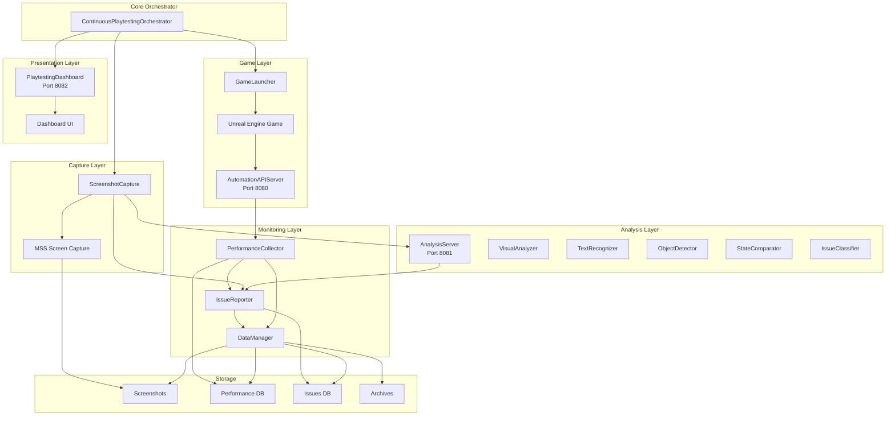
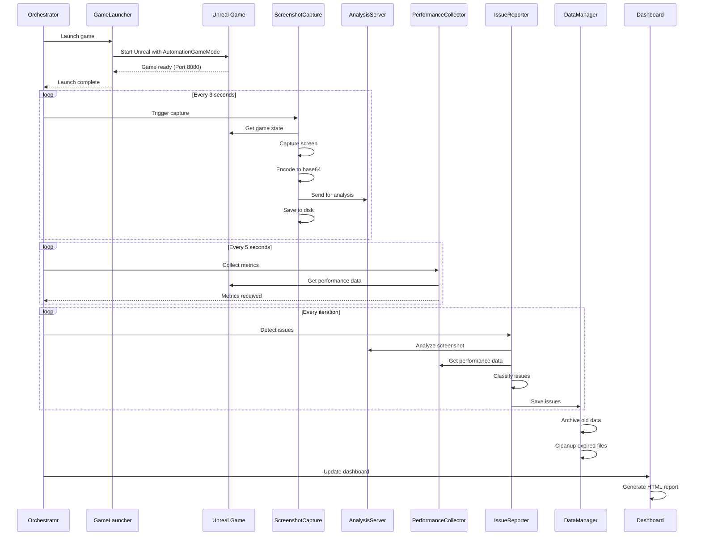
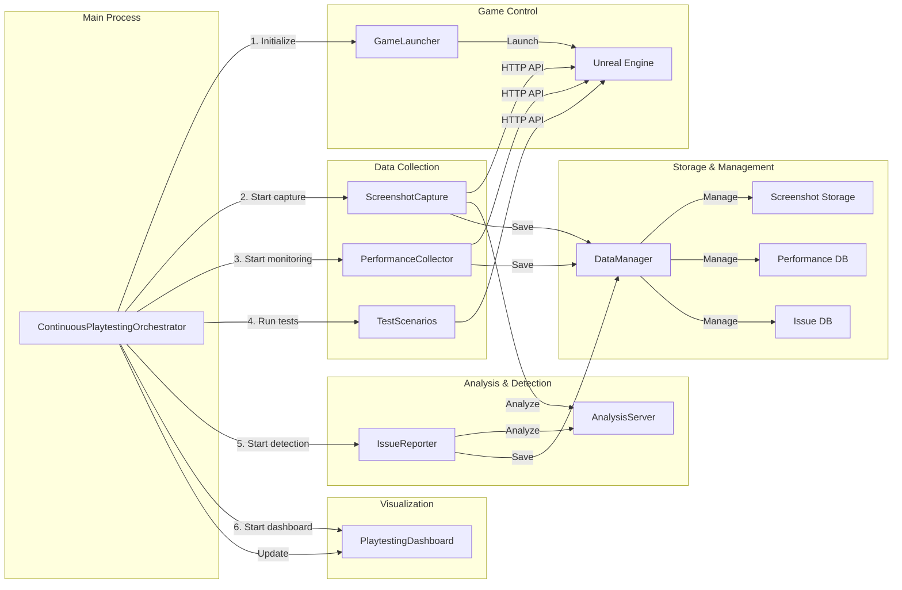

# Autonomous Playtesting System Architecture

**Version**: 1.0.0  
**Last Updated**: 2025-11-11

## Table of Contents
1. [System Overview](#system-overview)
2. [Architecture Diagrams](#architecture-diagrams)
3. [Component Details](#component-details)
4. [API Endpoints](#api-endpoints)
5. [Data Flow](#data-flow)
6. [Configuration Structure](#configuration-structure)
7. [System Requirements](#system-requirements)

## System Overview

The Autonomous Playtesting System is a comprehensive automated testing framework for Unreal Engine games, specifically designed for the Alexander project. It enables continuous, unattended gameplay testing with visual verification, performance monitoring, and intelligent issue detection.

### Key Capabilities
- **Continuous Automated Testing**: 24/7 unattended gameplay testing
- **Visual Verification**: Screenshot-based UI and gameplay validation
- **Performance Monitoring**: Real-time FPS, memory, and frame time tracking
- **Issue Detection**: AI-powered bug and anomaly detection
- **Data Management**: Automated storage, archiving, and cleanup
- **Interactive Dashboard**: Real-time test results and metrics visualization

### System Ports
- **Port 8080**: Game HTTP API (AutomationAPIServer)
- **Port 8081**: Visual Analysis API Server
- **Port 8082**: Playtesting Dashboard

## Architecture Diagrams

### High-Level System Architecture



### Data Flow Diagram



### Component Interaction Diagram



## Component Details

### 1. ContinuousPlaytestingOrchestrator
**File**: `continuous_playtesting.py`

The central orchestrator that coordinates all system components and manages the continuous testing loop.

**Key Responsibilities**:
- Initialize and start all components
- Launch and monitor game process
- Coordinate test iterations
- Manage system state and configuration
- Handle graceful shutdown

**Configuration**:
```json
{
  "continuous_playtesting": {
    "session_timeout_minutes": 60,
    "max_consecutive_failures": 3,
    "max_iterations": 0,
    "iteration_delay_seconds": 30
  }
}
```

### 2. GameLauncher
**File**: `launch_game_desktop.py`

Launches the Unreal Engine game in desktop mode with AutomationGameMode.

**Key Features**:
- Process monitoring and automatic restart
- HTTP API health checks
- Graceful shutdown handling
- Configuration management
- Process health monitoring (memory, responsiveness)

**Launch Parameters**:
- Resolution: 1280x720 (configurable)
- Quality: Medium (configurable)
- HTTP Port: 8080
- Console and debug options

### 3. ScreenshotCapture
**File**: `capture_screenshot.py`

High-frequency screenshot capture system with AI transmission capabilities.

**Key Features**:
- MSS-based screen capture
- Base64 encoding with JPEG compression
- Metadata embedding (game state, timestamp)
- Automatic cleanup and retention
- Configurable capture intervals
- AI system integration

**Configuration**:
```json
{
  "screenshot_capture": {
    "capture_interval": 3.0,
    "jpeg_quality": 85,
    "max_screenshots": 1000,
    "auto_cleanup": true,
    "enable_ai_transmission": true
  }
}
```

### 4. AnalysisServer
**File**: `analysis_server.py`

Visual verification pipeline providing REST API endpoints for screenshot analysis.

**API Endpoints**:
- `POST /analyze_screenshot` - Comprehensive screenshot analysis
- `POST /compare_states` - Compare two screenshots
- `GET /analysis_history` - Retrieve analysis history
- `GET /health` - Health check
- `GET /config` - Configuration

**Analysis Modules**:
- **VisualAnalyzer**: UI element detection and visual artifact identification
- **TextRecognizer**: OCR for text extraction and verification
- **ObjectDetector**: Game object detection and tracking
- **StateComparator**: Screenshot comparison against expected states
- **IssueClassifier**: AI-powered issue classification

### 5. PerformanceCollector
**File**: `performance_collector.py`

Collects and monitors game performance metrics.

**Metrics Tracked**:
- FPS (frames per second)
- Frame time (ms)
- Memory usage (MB)
- CPU usage
- GPU usage
- Draw calls
- Actor count

**Features**:
- Baseline establishment
- Regression detection
- Historical trend analysis
- Alert generation

### 6. IssueReporter
**File**: `issue_reporter.py`

Detects, classifies, and reports issues with GitHub integration.

**Issue Types**:
- **Performance**: Low FPS, high memory, frame time spikes
- **Visual**: UI artifacts, rendering issues, text problems
- **Gameplay**: Player stuck, mission blocked, logic errors

**Features**:
- SQLite database for issue tracking
- Frequency-based pattern detection
- GitHub ticket creation
- Severity classification (critical, high, medium, low)
- Recommended fixes generation

### 7. DataManager
**File**: `data_manager.py`

Manages data storage, archiving, retention, and backups.

**Responsibilities**:
- Screenshot storage and cleanup
- Performance data archiving
- Issue database management
- Automated backups
- Data retention policy enforcement
- Storage statistics

**Retention Configuration**:
```json
{
  "data_management": {
    "data_retention_days": 30,
    "compress_old_data": true,
    "cleanup_interval_hours": 24
  }
}
```

### 8. PlaytestingDashboard
**File**: `playtesting_dashboard.py`

Web-based dashboard for real-time test monitoring (Port 8082).

**Features**:
- Real-time test results
- Performance metrics visualization
- Issue tracking display
- Screenshot gallery
- System control interface
- Auto-refresh capability

**API Endpoints**:
- `GET /` - Main dashboard
- `GET /api/status` - System status
- `GET /api/test_results` - Test results
- `GET /api/performance` - Performance metrics
- `GET /api/issues` - Issue reports
- `POST /api/control` - System control

## API Endpoints

### Port 8080: Game HTTP API (AutomationAPIServer)

| Method | Endpoint | Description |
|--------|----------|-------------|
| GET | `/status` | Game status and health check |
| GET | `/game_state` | Current game state |
| GET | `/performance_metrics` | Performance data |
| POST | `/spawn_ship` | Spawn a ship |
| POST | `/set_input` | Set ship input |
| GET | `/get_position/{ship_id}` | Get ship position |
| GET | `/get_velocity/{ship_id}` | Get ship velocity |
| POST | `/execute_command` | Execute console command |

### Port 8081: Analysis API Server

| Method | Endpoint | Description |
|--------|----------|-------------|
| POST | `/analyze_screenshot` | Analyze screenshot |
| POST | `/compare_states` | Compare two screenshots |
| GET | `/analysis_history` | Get analysis history |
| GET | `/health` | Health check |
| GET | `/config` | Get configuration |

### Port 8082: Playtesting Dashboard

| Method | Endpoint | Description |
|--------|----------|-------------|
| GET | `/` | Main dashboard UI |
| GET | `/api/status` | System status |
| GET | `/api/test_results` | Test results data |
| GET | `/api/performance` | Performance metrics |
| GET | `/api/issues` | Issue reports |
| GET | `/api/screenshot` | Latest screenshot |
| POST | `/api/control` | Control system |

## Data Flow

### Screenshot Pipeline
1. **Capture**: MSS captures game window every 3 seconds
2. **Encoding**: Image converted to base64 with JPEG compression
3. **Metadata**: Game state and capture info embedded
4. **Storage**: Saved to disk with metadata
5. **Analysis**: Sent to AnalysisServer for visual verification
6. **Issue Detection**: Results processed by IssueReporter

### Performance Pipeline
1. **Collection**: Metrics gathered every 5 seconds via HTTP API
2. **Baseline**: First iteration establishes performance baseline
3. **Comparison**: Subsequent iterations compared against baseline
4. **Regression Detection**: Significant deviations trigger alerts
5. **Storage**: Metrics stored in performance database
6. **Reporting**: Integrated into dashboard and reports

### Issue Detection Pipeline
1. **Data Collection**: Screenshots, performance metrics, game state
2. **Analysis**: Visual, text, and object analysis
3. **Classification**: AI-powered issue classification
4. **Correlation**: Issues correlated with performance data
5. **Reporting**: Structured reports with recommendations
6. **GitHub Integration**: Critical issues create GitHub tickets

## Configuration Structure

### Main Configuration File: `playtesting_config.json`

```json
{
  "desktop_launcher": {
    "default_resolution": "1280x720",
    "default_quality": "medium",
    "default_port": 8080,
    "max_restarts": 3,
    "timeout_seconds": 0,
    "enable_console": true,
    "enable_debug": true
  },
  "screenshot_capture": {
    "capture_interval": 3.0,
    "jpeg_quality": 85,
    "max_screenshots": 1000,
    "auto_cleanup": true,
    "enable_compression": true,
    "enable_ai_transmission": true
  },
  "test_scenarios": {
    "default_timeout": 300,
    "max_attempts": 3,
    "scenario_configs": {
      "first_mission": { "timeout": 180, "success_criteria": {} },
      "trading_system": { "timeout": 240, "success_criteria": {} },
      "combat_scenario": { "timeout": 300, "randomize": true },
      "free_exploration": { "timeout": 600, "randomize": true }
    }
  },
  "performance_monitoring": {
    "track_fps": true,
    "track_memory": true,
    "track_hardware": true,
    "fps_warning_threshold": 30,
    "memory_warning_threshold_mb": 4096
  },
  "http_api_server": {
    "listen_port": 8080,
    "max_requests_per_second": 60,
    "enable_verbose_logging": true,
    "cors_enabled": true
  },
  "logging": {
    "log_level": "INFO",
    "log_to_file": true,
    "log_to_console": true,
    "max_log_file_size_mb": 100,
    "max_log_files": 10
  },
  "data_management": {
    "data_retention_days": 30,
    "compress_old_data": true,
    "cleanup_interval_hours": 24
  }
}
```

### Directory Structure
```
automation_config/
├── playtesting_config.json    # Main configuration
├── screenshot_config.json     # Screenshot settings
├── logs/                      # System logs
└── game_process.json         # Process tracking

playtesting_data/
├── sessions/                  # Test session data
├── performance/              # Performance metrics
├── issues/                   # Issue reports
├── issues.db                 # Issues database
├── archive/                  # Archived data
├── backups/                  # Critical backups
└── exports/                  # Data exports

screenshots_visual_playtest/
├── screenshot_*.jpg          # Captured screenshots
└── metadata.jsonl            # Screenshot metadata
```

## System Requirements

### Hardware Requirements
- **CPU**: Quad-core processor (8+ cores recommended)
- **RAM**: 16GB minimum (32GB recommended)
- **Storage**: 50GB free space for data collection
- **GPU**: DirectX 11 compatible (for Unreal game)
- **Network**: Localhost connectivity for API communication

### Software Requirements
- **Operating System**: Windows 10/11
- **Python**: 3.8 or higher
- **Unreal Engine**: 5.6 or compatible version
- **Tesseract OCR**: For text recognition
- **Dependencies**: See requirements section

### Python Dependencies
```txt
flask==2.3.2
flask-cors==4.0.0
requests==2.31.0
psutil==5.9.5
opencv-python==4.8.0.76
pillow==10.0.0
mss==9.0.1
numpy==1.24.3
```

### Unreal Engine Requirements
- AutomationGameMode implementation
- HTTP API server component
- Performance profiling enabled
- Console command support

## Performance Considerations

### Resource Usage
- **CPU**: ~5-10% during normal operation
- **Memory**: ~500MB base + screenshot buffers
- **Disk**: ~1GB per hour (configurable)
- **Network**: Localhost only, minimal external traffic

### Scalability
- Supports multiple concurrent test scenarios
- Configurable capture intervals and quality
- Automatic data cleanup and archiving
- Modular architecture for component scaling

## Security Considerations

- All APIs bind to localhost only
- CORS enabled for dashboard access
- No sensitive data in logs or screenshots
- Configurable data retention policies
- Secure file permissions on data directories

## Monitoring and Maintenance

### Health Checks
- Game process monitoring with automatic restart
- HTTP API health endpoints
- Disk space monitoring
- Memory usage alerts

### Maintenance Tasks
- Daily data cleanup
- Weekly archive compression
- Monthly backup verification
- Log rotation and management

---

**Next Steps**: See [PLAYTESTING_SETUP_GUIDE.md](PLAYTESTING_SETUP_GUIDE.md) for installation instructions.