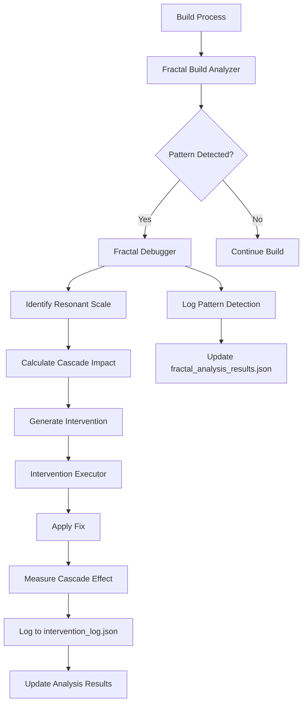

# Fractal Debugging Framework - Architecture Design

## Overview

The Fractal Debugging Framework implements the Resonance Debugging Protocol (RDP) to transform reactive "wave after wave" debugging into systematic, pattern-based root cause analysis with measurable cascade effects. This framework integrates with Alexander's existing file-based state coordination and build systems.

## Core Architecture

### 1. Resonant Scale Classification

The framework identifies issues across four resonant scales:

**Micro Scale** (Function/Variable Level)
- Null pointer dereferences (TWeakObjectPtr issues)
- Uninitialized UPROPERTY values
- Missing include dependencies
- Local variable scope problems

**Meso Scale** (Class/Component Level)  
- Circular dependencies between systems
- Subsystem initialization order issues
- Tight coupling patterns
- Component replication mismatches

**Macro Scale** (Module/System Level)
- API signature mismatches and deprecated usage
- Module dependency conflicts
- Build configuration inconsistencies
- Cross-system state desynchronization

**Meta Scale** (Project/Architecture Level)
- Engine version compatibility issues
- Project-wide configuration drift
- Architecture pattern violations
- Build pipeline integration failures

### 2. Pattern Signature System

#### Core Pattern Structure
```python
class PatternSignature:
    pattern_id: str                    # Unique identifier
    resonant_scale: ResonantScale      # Micro/Meso/Macro/Meta
    signature_regex: List[str]         # Detection patterns
    context_indicators: List[str]      # Contextual clues
    cascade_weight: float              # Impact multiplier
    historical_frequency: int          # Occurrence count
    dynamic_priority: float            # Calculated priority
```

#### Unreal Engine-Specific Patterns

**`null_cascade_ue`** - Null Pointer Cascade
- **Scale**: Micro → Meso
- **Signatures**: TWeakObjectPtr access, missing nullptr checks, uninitialized UPROPERTY
- **Cascade Risk**: High - can cause chain reaction crashes
- **Example**: `Error: Accessed None trying to read property`

**`state_desync_ue`** - State Desynchronization  
- **Scale**: Meso → Macro
- **Signatures**: Subsystem init order issues, replication lag, async timing problems
- **Cascade Risk**: Medium - causes inconsistent gameplay behavior
- **Example**: `Warning: Replicated property changed outside of replication`

**`coupling_cascade_ue`** - Tight Coupling Cascade
- **Scale**: Meso → Macro
- **Signatures**: Circular dependencies, excessive friend classes, cross-module includes
- **Cascade Risk**: High - causes compilation cascades and maintainability issues
- **Example**: `Error: Circular dependency detected between modules`

**`api_drift_ue`** - API Drift/Deprecation
- **Scale**: Macro → Meta  
- **Signatures**: Deprecated function usage, signature mismatches, engine version conflicts
- **Cascade Risk**: Medium - causes build failures across multiple files
- **Example**: `Error: Function 'X' is deprecated, please use 'Y' instead`

### 3. Cascade Effect Measurement

The framework measures cascade effects across three dimensions with weighted scoring:

#### File Impact Score (Weight: 0.3)
```python
file_impact = (
    files_modified * 0.4 +          # Direct changes
    dependencies_affected * 0.3 +    # Indirect dependencies
    headers_included * 0.2 +         # Header propagation
    build_files_changed * 0.1        # Build system impact
)
```

#### Build-Time Impact Score (Weight: 0.3)
```python
build_impact = (
    compilation_time_delta * 0.5 +   # Time change
    modules_rebuilt * 0.3 +          # Modules affected
    link_time_delta * 0.2            # Linking overhead
)
```

#### Runtime Impact Score (Weight: 0.4)
```python
runtime_impact = (
    memory_delta * 0.3 +             # Memory usage change
    performance_delta * 0.3 +        # FPS/frametime impact
    error_rate_delta * 0.2 +         # Error frequency change
    stability_score * 0.2            # Crash rate improvement
)
```

**Total Cascade Score**: `weighted_sum = (file_impact * 0.3) + (build_impact * 0.3) + (runtime_impact * 0.4)`

### 4. Framework Components

#### [`fractal_debugger.py`](fractal_debugger.py:1) - Core Engine
- **Resonance Pattern Detection**: Multi-scale pattern matching engine
- **Cascade Analysis**: Impact measurement and prediction
- **Intervention Planning**: Targeted fix recommendation
- **Integration Hub**: Coordinates all framework components

#### [`pattern_signatures_unreal.py`](pattern_signatures_unreal.py:1) - UE Pattern Library
- **Pattern Definitions**: Unreal Engine-specific bug patterns
- **Signature Database**: Regex patterns and detection rules
- **Context Analysis**: UE-specific context extraction
- **Priority Calculation**: Dynamic priority based on frequency/impact

#### [`file_based_state_scanner.py`](file_based_state_scanner.py:1) - State Integration
- **Session State Monitoring**: Tracks [`session_state.json`](session_state.json:1) changes
- **Execution Queue Analysis**: Monitors [`execution_queue.json`](execution_queue.json:1) patterns
- **Build Output Parsing**: Extracts structured data from build logs
- **State Synchronization**: Maintains framework state consistency

#### [`intervention_executor.py`](intervention_executor.py:1) - Fix Application
- **Automated Fixes**: Applies targeted interventions
- **Cascade Measurement**: Quantifies intervention impact
- **Rollback Capability**: Reverts failed interventions
- **Validation Testing**: Verifies fix effectiveness

#### [`fractal_build_analyzer.py`](fractal_build_analyzer.py:1) - Build Analysis
- **Real-time Monitoring**: Watches compilation output
- **Pattern Detection**: Identifies patterns during build
- **Error Correlation**: Links errors to pattern signatures
- **Build Metrics**: Collects compilation performance data

### 5. Integration Points

#### Input Sources
- **Build Pipeline**: [`build_and_test.py`](build_and_test.py:1) output
- **State Files**: [`session_state.json`](session_state.json:1), [`execution_queue.json`](execution_queue.json:1)
- **Compilation Logs**: Real-time build output streams
- **Error Reports**: [`compilation_errors_report.json`](compilation_errors_report.json:1) format

#### Output Destinations
- **Analysis Results**: [`fractal_analysis_results.json`](fractal_analysis_results.json:1) 
- **Intervention Log**: [`intervention_log.json`](intervention_log.json:1)
- **Build Reports**: Enhanced build reports with pattern analysis
- **State Updates**: Coordinated updates to existing state files

### 6. Workflow Integration



### 7. Dynamic Priority Calculation

Pattern priority is calculated using:

```python
dynamic_priority = (
    base_priority * 0.3 +                    # Static pattern priority
    (historical_frequency / max_freq) * 0.3 + # Frequency weight
    (cascade_weight / max_cascade) * 0.2 +   # Cascade impact weight
    (detection_confidence * 0.2)             # Detection certainty
)
```

### 8. Real-Time vs Post-Build Analysis

**Real-Time Mode** (During Compilation)
- Monitors build output streams
- Provides immediate pattern detection
- Enables rapid intervention
- Lower confidence threshold

**Post-Build Mode** (After Compilation)
- Analyzes complete build results
- Higher confidence pattern matching
- Comprehensive cascade analysis
- Generates detailed reports

### 9. Success Criteria

The framework successfully integrates when:
- ✅ Analyzes build failures and identifies pattern signatures
- ✅ Detects resonant scales (Micro/Meso/Macro/Meta)
- ✅ Suggests targeted interventions with predicted cascade effects
- ✅ Measures actual cascade effects post-intervention
- ✅ Integrates seamlessly with existing [`build_and_test.py`](build_and_test.py:1) workflow
- ✅ Maintains compatibility with [`session_state.json`](session_state.json:1) and [`execution_queue.json`](execution_queue.json:1) coordination

### 10. Implementation Phases

**Phase 1**: Core framework infrastructure
**Phase 2**: Pattern signature library
**Phase 3**: Build pipeline integration  
**Phase 4**: Real-time monitoring
**Phase 5**: Advanced cascade prediction

This architecture provides a robust foundation for systematic, pattern-based debugging that transforms reactive troubleshooting into proactive root cause analysis with measurable outcomes.