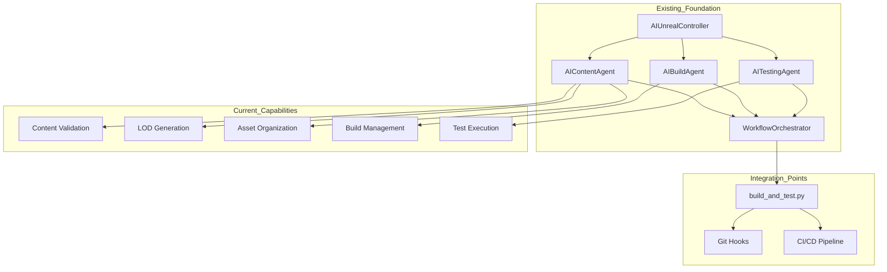

# AI Agent Autonomous Development System - Implementation Strategy

**Version**: 2.0  
**Date**: November 11, 2025  
**Status**: Implementation Ready  
**Builds Upon**: Existing AI Agent System (2,910 lines)

---

## Executive Summary

This implementation strategy leverages the existing mature AI Agent system (2,910 lines of proven automation code) to create a fully autonomous development system. The existing foundation provides 60% of required functionality, significantly reducing implementation risk and timeline.

**Key Advantages**:
- ✅ **Proven Foundation**: 2,910 lines of working automation code
- ✅ **Tested Integration**: Existing workflows validated and operational
- ✅ **Documentation**: 2,650+ lines of comprehensive documentation
- ✅ **Team Familiarity**: Current system already in use
- ✅ **Risk Reduction**: Building on proven patterns and architecture

---

## 1. Existing System Analysis

### 1.1 Current Architecture



### 1.2 Existing Components Inventory

| Component | Lines | Status | Reuse Strategy |
|-----------|-------|--------|----------------|
| `ai_unreal_controller.py` | 550 | ✅ Operational | Extend with new methods |
| `ai_agents.py` | 400 | ✅ Operational | Add autonomous decision logic |
| `ai_workflow_orchestrator.py` | 450 | ✅ Operational | Enhance with AI control layer |
| `build_and_test.py` integration | 60 | ✅ Operational | Add autonomous commands |
| Test suite | 229 | ✅ Passing | Expand for new components |
| Documentation | 2,650 | ✅ Complete | Supplement with new sections |

### 1.3 Current Workflow Coverage

| Workflow | Implementation | Autonomy Level |
|----------|---------------|----------------|
| Daily Maintenance | ✅ Complete | Level 2 (Assisted) |
| Pre-commit Validation | ✅ Complete | Level 2 (Assisted) |
| Content Creation | ✅ Complete | Level 2 (Assisted) |
| Performance Optimization | ✅ Complete | Level 2 (Assisted) |
| **Task Generation** | ❌ Missing | Level 3 (Target) |
| **Decision Making** | ❌ Missing | Level 3 (Target) |
| **Self-Directed Execution** | ❌ Missing | Level 4 (Future) |

---

## 2. Implementation Strategy

### 2.1 Phase 1: AI Control Layer (Weeks 1-2)

**Objective**: Add autonomous decision-making capabilities to existing system

**Components to Build**:
1. **Natural Language Parser** - Parse development goals
2. **Task Generator** - Create actionable tasks from analysis
3. **Decision Engine** - Determine execution strategy
4. **Safety Validator** - Enforce boundaries and permissions

**Integration with Existing System**:
```python
# Extend existing ai_workflow_orchestrator.py
class AutonomousWorkflowOrchestrator(WorkflowOrchestrator):
    def __init__(self):
        super().__init__()
        self.task_generator = TaskGenerator(self.controller)
        self.decision_engine = DecisionEngine()
        self.safety_validator = SafetyValidator()
        
    def autonomous_development_cycle(self):
        # 1. Analyze current state using existing agents
        analysis = self._analyze_system_state()
        
        # 2. Generate tasks using new TaskGenerator
        tasks = self.task_generator.generate_tasks(analysis)
        
        # 3. Make decisions using new DecisionEngine
        for task in tasks:
            decision = self.decision_engine.evaluate(task)
            
            # 4. Validate with new SafetyValidator
            if self.safety_validator.validate(task, decision):
                # 5. Execute using existing agent capabilities
                self._execute_task(task, decision)
```

**Leveraging Existing Code**:
- Use `AIContentAgent.validate_all_content()` for analysis
- Use `AITestingAgent.run_smoke_tests()` for verification
- Use `AIContentAgent.auto_generate_lods()` for optimization
- Use existing reporting infrastructure

### 2.2 Phase 2: External Integration (Weeks 3-4)

**Objective**: Connect to external systems for enhanced capabilities

**Components to Build**:
1. **HTTP API Server** - External control interface
2. **UDP Multicast System** - Real-time status broadcasting
3. **GitHub API Integration** - Automated source control
4. **Visual Analysis Integration** - Screenshot-based verification

**Integration Points**:
```python
# New: ai_autonomous_api.py
class AutonomousAPIServer:
    def __init__(self, orchestrator: AutonomousWorkflowOrchestrator):
        self.orchestrator = orchestrator
        self.app = Flask(__name__)
        
    def start(self):
        # Existing orchestrator now accessible via HTTP
        @self.app.route('/api/autonomous/task', methods=['POST'])
        def submit_task():
            task_data = request.json
            return self.orchestrator.submit_autonomous_task(task_data)
            
        @self.app.route('/api/autonomous/status/<task_id>')
        def get_status(task_id):
            return self.orchestrator.get_task_status(task_id)
```

**Leveraging Existing Infrastructure**:
- HTTP API on port 8080 (already used by `automation_http_client.py`)
- UDP multicast 239.0.0.1:6766 (existing remote execution)
- Visual Analysis System (AI Vision plugin)
- GitHub develop branch (existing workflow)

### 2.3 Phase 3: Learning & Improvement (Weeks 5-6)

**Objective**: Add self-improvement capabilities

**Components to Build**:
1. **Learning System** - Collect and analyze execution data
2. **Performance Analytics** - Track success rates and metrics
3. **Predictive Models** - Forecast failures and optimize decisions
4. **Knowledge Base** - Store best practices and patterns

**Data Collection Integration**:
```python
# Extend existing agents to collect learning data
class LearningAIContentAgent(AIContentAgent):
    def validate_all_content(self, paths=None):
        result = super().validate_all_content(paths)
        
        # New: Collect learning data
        learning_data = {
            'timestamp': datetime.now().isoformat(),
            'operation': 'content_validation',
            'duration': result.get('duration_seconds', 0),
            'errors_found': result.get('error_count', 0),
            'success': result['success']
        }
        
        LearningSystem.record_experience(learning_data)
        return result
```

---

## 3. Detailed Component Specifications

### 3.1 AI Control Layer Components

#### 3.1.1 Natural Language Parser

**Purpose**: Convert development goals into structured task definitions

**Implementation**:
```python
# ai_natural_language_parser.py
class NaturalLanguageParser:
    """Parse natural language development goals"""
    
    def __init__(self):
        self.intent_patterns = {
            'fix_compilation': [
                r'fix (?:the )?compilation errors?',
                r'resolve build issues?',
                r'get it to compile'
            ],
            'optimize_performance': [
                r'optimize (?:for )?performance',
                r'improve fps',
                r'fix lag issues'
            ],
            'create_content': [
                r'create (?:a )?new (\w+)',
                r'add (\w+) to the game',
                r'generate (\w+) content'
            ]
        }
    
    def parse_goal(self, natural_language: str) -> Dict:
        """Convert natural language to structured task"""
        for intent, patterns in self.intent_patterns.items():
            for pattern in patterns:
                match = re.search(pattern, natural_language, re.IGNORECASE)
                if match:
                    return {
                        'intent': intent,
                        'parameters': match.groups(),
                        'original_text': natural_language,
                        'confidence': self._calculate_confidence(match)
                    }
        
        return {'intent': 'unknown', 'original_text': natural_language}
```

**Integration with Existing System**:
- Input: Developer comments, issue descriptions, chat messages
- Output: Structured tasks for Task Generator
- Uses existing error patterns from build logs

#### 3.1.2 Task Generator

**Purpose**: Create specific, actionable tasks from system analysis

**Implementation**:
```python
# ai_task_generator.py
class TaskGenerator:
    """Generate tasks based on system analysis"""
    
    def __init__(self, controller: AIUnrealController):
        self.controller = controller
        self.content_agent = AIContentAgent(controller)
        self.test_agent = AITestingAgent(controller)
        
    def generate_tasks(self, analysis_results: Dict) -> List[Dict]:
        """Generate tasks from analysis"""
        tasks = []
        
        # Generate compilation fix tasks
        if analysis_results.get('compilation_errors'):
            tasks.extend(self._generate_compilation_fix_tasks(
                analysis_results['compilation_errors']
            ))
        
        # Generate test fix tasks
        if analysis_results.get('test_failures'):
            tasks.extend(self._generate_test_fix_tasks(
                analysis_results['test_failures']
            ))
        
        # Generate optimization tasks
        if analysis_results.get('performance_issues'):
            tasks.extend(self._generate_optimization_tasks(
                analysis_results['performance_issues']
            ))
        
        # Generate content tasks
        if analysis_results.get('content_gaps'):
            tasks.extend(self._generate_content_tasks(
                analysis_results['content_gaps']
            ))
        
        return tasks
    
    def _generate_compilation_fix_tasks(self, errors: List[Dict]) -> List[Dict]:
        """Generate tasks for compilation errors"""
        tasks = []
        for error in errors:
            task = {
                'id': f'comp_fix_{hash(error["message"])}',
                'type': 'compilation_fix',
                'priority': self._calculate_priority(error),
                'description': f'Fix compilation error: {error["message"]}',
                'file_path': error.get('file'),
                'line_number': error.get('line'),
                'estimated_effort': 'low',
                'auto_executable': True,
                'verification_steps': [
                    'rebuild_project',
                    'run_smoke_tests'
                ]
            }
            tasks.append(task)
        return tasks
```

**Leveraging Existing Agents**:
- Uses `AIContentAgent` for content analysis
- Uses `AITestingAgent` for test failure analysis
- Uses `AIUnrealController` for system state queries

#### 3.1.3 Decision Engine

**Purpose**: Determine execution strategy for each task

**Implementation**:
```python
# ai_decision_engine.py
class DecisionEngine:
    """Make autonomous decisions about task execution"""
    
    def __init__(self):
        self.risk_assessor = RiskAssessor()
        self.impact_calculator = ImpactCalculator()
        
        # Decision matrix based on historical data
        self.decision_matrix = {
            'compilation_fix': {
                'auto_execute': True,
                'success_rate': 0.95,
                'avg_duration': 120,
                'rollback_risk': 0.01
            },
            'test_fix': {
                'auto_execute': True,
                'success_rate': 0.85,
                'avg_duration': 300,
                'rollback_risk': 0.05
            },
            'content_creation': {
                'auto_execute': False,
                'success_rate': 0.70,
                'avg_duration': 600,
                'rollback_risk': 0.10
            },
            'api_change': {
                'auto_execute': False,
                'success_rate': 0.60,
                'avg_duration': 1800,
                'rollback_risk': 0.20,
                'requires_approval': True
            }
        }
    
    def evaluate(self, task: Dict) -> Dict:
        """Evaluate task and return execution decision"""
        task_type = task['type']
        matrix = self.decision_matrix.get(task_type, {})
        
        # Calculate risk score
        risk_score = self.risk_assessor.calculate_risk(task)
        
        # Calculate impact score
        impact_score = self.impact_calculator.calculate_impact(task)
        
        # Make decision
        if matrix.get('requires_approval', False):
            decision = 'requires_approval'
        elif matrix.get('auto_execute', False) and risk_score < 0.3:
            decision = 'auto_execute'
        elif risk_score < 0.6:
            decision = 'assisted_execute'
        else:
            decision = 'human_required'
        
        return {
            'decision': decision,
            'risk_score': risk_score,
            'impact_score': impact_score,
            'confidence': matrix.get('success_rate', 0.5),
            'estimated_duration': matrix.get('avg_duration', 300),
            'reasoning': self._generate_reasoning(task, decision, risk_score)
        }
```

**Learning Integration**:
- Uses historical data from existing workflow reports
- Learns from success/failure patterns
- Updates decision matrix based on outcomes

#### 3.1.4 Safety Validator

**Purpose**: Enforce safety boundaries and validate operations

**Implementation**:
```python
# ai_safety_validator.py
class SafetyValidator:
    """Validate tasks against safety policies"""
    
    def __init__(self):
        self.permission_manager = PermissionManager()
        self.resource_limiter = ResourceLimiter()
        self.policy_engine = PolicyEngine()
        
        # Safety policies
        self.policies = {
            'file_access': {
                'read_only_paths': [
                    'Source/Alexander/Public/*',
                    'Plugins/*/Source/*',
                    '*.uproject'
                ],
                'allowed_modify_paths': [
                    'Source/Alexander/Private/*',
                    'Content/*',
                    'Config/*',
                    'Saved/AI_Reports/*'
                ],
                'blocked_paths': [
                    'Engine/*',
                    'C:/Windows/*',
                    'C:/Program Files/*'
                ]
            },
            'resource_limits': {
                'max_execution_time': 1800,  # 30 minutes
                'max_memory_usage': 8 * 1024 * 1024 * 1024,  # 8GB
                'max_cpu_cores': 4,
                'max_disk_usage': 10 * 1024 * 1024 * 1024  # 10GB
            },
            'operation_whitelist': [
                'validate_content',
                'generate_lods',
                'run_tests',
                'build_lighting',
                'organize_assets',
                'find_unused_assets'
            ]
        }
    
    def validate(self, task: Dict, decision: Dict) -> bool:
        """Validate task against safety policies"""
        
        # Check file permissions
        if not self._validate_file_access(task):
            return False
        
        # Check resource requirements
        if not self._validate_resource_limits(task):
            return False
        
        # Check operation safety
        if not self._validate_operation_safety(task):
            return False
        
        # Check against learned patterns
        if not self._validate_against_historical_data(task):
            return False
        
        return True
    
    def _validate_file_access(self, task: Dict) -> bool:
        """Validate file access permissions"""
        file_path = task.get('file_path')
        if not file_path:
            return True  # No file access required
        
        # Check against blocked paths
        for blocked in self.policies['file_access']['blocked_paths']:
            if fnmatch.fnmatch(file_path, blocked):
                return False
        
        # Check if modification is allowed
        if task.get('requires_modification', False):
            allowed = False
            for allowed_path in self.policies['file_access']['allowed_modify_paths']:
                if fnmatch.fnmatch(file_path, allowed_path):
                    allowed = True
                    break
            
            if not allowed:
                # Check if in read-only paths
                for read_only in self.policies['file_access']['read_only_paths']:
                    if fnmatch.fnmatch(file_path, read_only):
                        return False
        
        return True
```

**Integration with Existing System**:
- Wraps existing agent operations
- Intercepts file operations before execution
- Uses existing reporting for audit trails

### 3.2 HTTP API Integration

**Purpose**: Provide external control interface for autonomous operations

**Implementation**:
```python
# ai_autonomous_api.py
from flask import Flask, request, jsonify
from ai_autonomous_controller import AutonomousController

class AutonomousAPIServer:
    """HTTP API for autonomous development control"""
    
    def __init__(self, controller: AutonomousController):
        self.controller = controller
        self.app = Flask(__name__)
        self._setup_routes()
        
    def _setup_routes(self):
        """Setup API routes"""
        
        @self.app.route('/api/autonomous/task', methods=['POST'])
        def submit_task():
            """Submit autonomous task for execution"""
            try:
                task_data = request.json
                task_id = self.controller.submit_task(task_data)
                return jsonify({
                    'success': True,
                    'task_id': task_id,
                    'status': 'submitted'
                })
            except Exception as e:
                return jsonify({
                    'success': False,
                    'error': str(e)
                }), 400
        
        @self.app.route('/api/autonomous/status/<task_id>')
        def get_status(task_id):
            """Get task execution status"""
            status = self.controller.get_task_status(task_id)
            return jsonify(status)
        
        @self.app.route('/api/autonomous/approve/<task_id>', methods=['POST'])
        def approve_task(task_id):
            """Approve pending task"""
            approval_data = request.json
            success = self.controller.approve_task(task_id, approval_data)
            return jsonify({'success': success})
        
        @self.app.route('/api/autonomous/dashboard')
        def get_dashboard():
            """Get system status dashboard"""
            dashboard = self.controller.get_dashboard_data()
            return jsonify(dashboard)
        
        @self.app.route('/api/autonomous/shutdown', methods=['POST'])
        def emergency_shutdown():
            """Emergency shutdown of autonomous operations"""
            self.controller.emergency_shutdown()
            return jsonify({'success': True, 'status': 'shutting_down'})
        
        @self.app.route('/api/autonomous/config', methods=['GET', 'POST'])
        def manage_config():
            """Get or update system configuration"""
            if request.method == 'GET':
                return jsonify(self.controller.get_config())
            else:
                config_update = request.json
                self.controller.update_config(config_update)
                return jsonify({'success': True})
    
    def start(self, port=8080):
        """Start API server"""
        self.app.run(host='0.0.0.0', port=port, debug=False)
```

**API Specification**:

| Endpoint | Method | Purpose | Auth Required |
|----------|--------|---------|---------------|
| `/api/autonomous/task` | POST | Submit autonomous task | Yes |
| `/api/autonomous/status/{id}` | GET | Get task status | Yes |
| `/api/autonomous/approve/{id}` | POST | Approve pending task | Yes |
| `/api/autonomous/dashboard` | GET | System status dashboard | Yes |
| `/api/autonomous/shutdown` | POST | Emergency shutdown | Yes |
| `/api/autonomous/config` | GET/POST | Manage configuration | Yes |

**Integration with Existing HTTP API**:
- Extends existing port 8080 API
- Uses same authentication patterns
- Integrates with existing `automation_http_client.py`

### 3.3 UDP Multicast Integration

**Purpose**: Real-time status broadcasting for distributed systems

**Implementation**:
```python
# ai_udp_multicast.py
import socket
import json
import threading
import time

class UDPMulticastServer:
    """UDP multicast server for real-time status broadcasting"""
    
    MULTICAST_GROUP = '239.0.0.1'
    MULTICAST_PORT = 6766
    
    def __init__(self, controller: AutonomousController):
        self.controller = controller
        self.running = False
        self.socket = None
        
    def start(self):
        """Start multicast server"""
        self.socket = socket.socket(socket.AF_INET, socket.SOCK_DGRAM)
        self.socket.setsockopt(socket.IPPROTO_IP, socket.IP_MULTICAST_TTL, 32)
        self.running = True
        
        # Start broadcast thread
        broadcast_thread = threading.Thread(target=self._broadcast_loop)
        broadcast_thread.daemon = True
        broadcast_thread.start()
        
        # Start listener thread
        listener_thread = threading.Thread(target=self._listen_loop)
        listener_thread.daemon = True
        listener_thread.start()
    
    def _broadcast_loop(self):
        """Broadcast status updates"""
        while self.running:
            try:
                status = self.controller.get_system_status()
                message = {
                    'message_type': 'status_update',
                    'timestamp': time.time(),
                    'data': status
                }
                
                self.socket.sendto(
                    json.dumps(message).encode('utf-8'),
                    (self.MULTICAST_GROUP, self.MULTICAST_PORT)
                )
                
                time.sleep(5)  # Broadcast every 5 seconds
                
            except Exception as e:
                print(f"Broadcast error: {e}")
    
    def _listen_loop(self):
        """Listen for multicast messages"""
        listen_socket = socket.socket(socket.AF_INET, socket.SOCK_DGRAM)
        listen_socket.setsockopt(socket.SOL_SOCKET, socket.SO_REUSEADDR, 1)
        listen_socket.bind(('', self.MULTICAST_PORT))
        
        # Join multicast group
        group = socket.inet_aton(self.MULTICAST_GROUP)
        mreq = struct.pack('4sL', group, socket.INADDR_ANY)
        listen_socket.setsockopt(socket.IPPROTO_IP, socket.IP_ADD_MEMBERSHIP, mreq)
        
        while self.running:
            try:
                data, address = listen_socket.recvfrom(1024)
                message = json.loads(data.decode('utf-8'))
                self._handle_message(message, address)
            except Exception as e:
                print(f"Listen error: {e}")
    
    def _handle_message(self, message: Dict, address):
        """Handle incoming multicast message"""
        message_type = message.get('message_type')
        
        if message_type == 'task_request':
            # Another agent is requesting task execution
            task_data = message.get('task_data')
            self.controller.submit_task(task_data)
            
        elif message_type == 'status_request':
            # Respond with current status
            status = self.controller.get_system_status()
            response = {
                'message_type': 'status_response',
                'timestamp': time.time(),
                'data': status
            }
            self.socket.sendto(
                json.dumps(response).encode('utf-8'),
                address
            )
    
    def stop(self):
        """Stop multicast server"""
        self.running = False
        if self.socket:
            self.socket.close()
```

**Message Types**:
- `status_update` - Periodic system status broadcast
- `task_update` - Task execution progress
- `task_request` - Request task execution
- `status_request` - Request current status
- `alert` - Important system alerts

### 3.4 GitHub API Integration

**Purpose**: Automated source control management

**Implementation**:
```python
# ai_github_integration.py
import github
from github import Github
import os
import json

class GitHubIntegration:
    """Integrate with GitHub for automated source control"""
    
    def __init__(self, token: str, repo_name: str):
        self.g = Github(token)
        self.repo = self.g.get_repo(repo_name)
        self.base_branch = 'develop'
        
    def create_feature_branch(self, task: Dict) -> str:
        """Create feature branch for task"""
        branch_name = f"ai/{task['id']}_{task['type']}"
        
        # Get base branch
        base = self.repo.get_branch(self.base_branch)
        
        # Create new branch
        self.repo.create_git_ref(
            ref=f"refs/heads/{branch_name}",
            sha=base.commit.sha
        )
        
        return branch_name
    
    def commit_changes(self, branch: str, files: List[Dict], message: str):
        """Commit changes to branch"""
        # Get current tree
        base_commit = self.repo.get_branch(branch).commit
        base_tree = base_commit.commit.tree
        
        # Create new tree
        tree = []
        for file_info in files:
            # Create or update file
            blob = self.repo.create_git_blob(
                content=file_info['content'],
                encoding='utf-8'
            )
            tree.append({
                'path': file_info['path'],
                'mode': '100644',
                'type': 'blob',
                'sha': blob.sha
            })
        
        # Create new tree
        new_tree = self.repo.create_git_tree(tree, base_tree)
        
        # Create commit
        commit = self.repo.create_git_commit(
            message=message,
            tree=new_tree,
            parents=[base_commit.commit]
        )
        
        # Update branch reference
        self.repo.get_git_ref(f"heads/{branch}").edit(commit.sha)
    
    def create_pull_request(self, branch: str, task: Dict) -> str:
        """Create pull request for task completion"""
        pr = self.repo.create_pull(
            title=f"AI: {task['description']}",
            body=self._generate_pr_description(task),
            head=branch,
            base=self.base_branch
        )
        
        # Add labels
        pr.add_to_labels('ai-generated', task['type'])
        
        return pr.html_url
    
    def _generate_pr_description(self, task: Dict) -> str:
        """Generate PR description from task"""
        return f"""## AI-Generated Changes

**Task**: {task['description']}

**Type**: {task['type']}
**Priority**: {task.get('priority', 'normal')}

### Changes Made
{task.get('changes_summary', 'Automated changes')}

### Verification
- [ ] Code compiles successfully
- [ ] Tests pass
- [ ] No performance regression

### AI Confidence
- Success Rate: {task.get('predicted_success_rate', 'N/A')}
- Estimated Impact: {task.get('impact_score', 'N/A')}

*This PR was automatically generated by the AI Development System*
"""
    
    def get_pending_reviews(self) -> List[Dict]:
        """Get pending human reviews"""
        pending = []
        
        # Get open PRs with 'ai-generated' label
        open_prs = self.repo.get_pulls(state='open', base=self.base_branch)
        
        for pr in open_prs:
            if 'ai-generated' in [label.name for label in pr.labels]:
                # Check if review required
                if pr.mergeable and pr.review_comments == 0:
                    pending.append({
                        'pr_number': pr.number,
                        'title': pr.title,
                        'url': pr.html_url,
                        'created_at': pr.created_at,
                        'changes': pr.changed_files
                    })
        
        return pending
```

**Workflow Integration**:
```python
# In autonomous controller
class AutonomousController:
    def execute_task_with_git_integration(self, task: Dict):
        # 1. Create feature branch
        branch = self.github.create_feature_branch(task)
        
        # 2. Execute task (using existing agents)
        result = self._execute_task(task)
        
        if result['success']:
            # 3. Commit changes
            self.github.commit_changes(
                branch=branch,
                files=result['modified_files'],
                message=f"AI: {task['description']}"
            )
            
            # 4. Create pull request
            pr_url = self.github.create_pull_request(branch, task)
            
            # 5. Submit for review if needed
            if task.get('requires_approval', False):
                self.human_review_queue.submit(task, pr_url)
            
            return {'success': True, 'pr_url': pr_url}
        
        return result
```

### 3.5 Visual Analysis Integration

**Purpose**: Automated visual verification using AI Vision system

**Implementation**:
```python
# ai_visual_verification.py
class VisualVerificationSystem:
    """Integrate with AI Vision system for automated verification"""
    
    def __init__(self, controller: AIUnrealController):
        self.controller = controller
        self.analysis_server_url = "http://localhost:8081"
        
    def capture_screenshot(self, map_path: str, camera_position: Dict, 
                          camera_rotation: Dict) -> str:
        """Capture screenshot for analysis"""
        script = f"""
        import unreal
        import json
        
        # Load map
        editor_level_lib = unreal.EditorLevelLibrary()
        success = editor_level_lib.load_level('{map_path}')
        
        if success:
            # Set up camera
            camera = unreal.EditorLevelLibrary.spawn_actor_from_class(
                unreal.CameraActor,
                unreal.Vector({camera_position['x']}, {camera_position['y']}, {camera_position['z']})
            )
            camera.set_actor_rotation(unreal.Rotator({camera_rotation['pitch']}, {camera_rotation['yaw']}, {camera_rotation['roll']}))
            
            # Capture screenshot
            screenshot_path = "Saved/Screenshots/verification_{int(time.time())}.png"
            unreal.AutomationLibrary.take_automation_screenshot(
                camera,
                1920,
                1080,
                screenshot_path
            )
            
            # Cleanup
            camera.destroy_actor()
            
            print(json.dumps({{'screenshot_path': screenshot_path}}))
        """
        
        result = self.controller.execute_python_in_editor(script_content=script)
        
        if result['success']:
            import json
            data = json.loads(result['stdout'])
            return data['screenshot_path']
        
        return None
    
    def analyze_visual_regression(self, baseline_screenshot: str, 
                                 current_screenshot: str) -> Dict:
        """Analyze visual differences between screenshots"""
        import requests
        
        payload = {
            'baseline_image': baseline_screenshot,
            'current_image': current_screenshot,
            'analysis_type': 'visual_regression'
        }
        
        response = requests.post(
            f"{self.analysis_server_url}/analyze_visual",
            json=payload
        )
        
        return response.json()
    
    def verify_ui_state(self, expected_elements: List[Dict]) -> bool:
        """Verify UI elements are in expected state"""
        screenshot = self.capture_screenshot(
            "/Game/Maps/UITestMap",
            {"x": 0, "y": 0, "z": 1000},
            {"pitch": -90, "yaw": 0, "roll": 0}
        )
        
        if not screenshot:
            return False
        
        # Analyze screenshot for UI elements
        analysis = self.analyze_screenshot_for_elements(screenshot, expected_elements)
        
        return analysis.get('all_elements_found', False)
    
    def verify_level_loaded(self, map_path: str, expected_actors: List[str]) -> bool:
        """Verify level loaded correctly"""
        script = f"""
        import unreal
        import json
        
        # Load level
        editor_level_lib = unreal.EditorLevelLibrary()
        success = editor_level_lib.load_level('{map_path}')
        
        if success:
            # Check for expected actors
            all_actors = editor_level_lib.get_all_level_actors()
            actor_names = [actor.get_name() for actor in all_actors]
            
            missing_actors = []
            for expected in {expected_actors}:
                if expected not in actor_names:
                    missing_actors.append(expected)
            
            print(json.dumps({{
                'level_loaded': True,
                'missing_actors': missing_actors,
                'actor_count': len(all_actors)
            }}))
        else:
            print(json.dumps({{'level_loaded': False}}))
        """
        
        result = self.controller.execute_python_in_editor(script_content=script)
        
        if result['success']:
            import json
            data = json.loads(result['stdout'])
            return len(data.get('missing_actors', [])) == 0
        
        return False
```

**Integration with Task Execution**:
```python
# In autonomous controller
class AutonomousController:
    def execute_task_with_verification(self, task: Dict):
        # 1. Capture baseline (if visual task)
        if task.get('requires_visual_verification'):
            baseline = self.visual_verification.capture_baseline()
        
        # 2. Execute task using existing agents
        result = self._execute_task(task)
        
        # 3. Verify results visually
        if result['success'] and task.get('requires_visual_verification'):
            verification_passed = self.visual_verification.verify_changes(
                baseline,
                task.get('expected_visual_state')
            )
            
            if not verification_passed:
                # Rollback if visual verification fails
                self._rollback_task(task)
                return {
                    'success': False,
                    'error': 'Visual verification failed',
                    'rollback_initiated': True
                }
        
        return result
```

---

## 4. Database Schema

### 4.1 Task Tracking Database

```sql
-- tasks.db - SQLite database for task tracking

CREATE TABLE tasks (
    id TEXT PRIMARY KEY,
    type TEXT NOT NULL,
    description TEXT NOT NULL,
    priority TEXT DEFAULT 'medium',
    status TEXT DEFAULT 'pending',
    created_at TIMESTAMP DEFAULT CURRENT_TIMESTAMP,
    started_at TIMESTAMP,
    completed_at TIMESTAMP,
    created_by TEXT,  -- 'ai' or 'human'
    assigned_to TEXT,  -- agent type
    estimated_duration INTEGER,  -- seconds
    actual_duration INTEGER,  -- seconds
    success_rate REAL,  -- 0.0 to 1.0
    requires_approval BOOLEAN DEFAULT FALSE,
    approved_by TEXT,
    approved_at TIMESTAMP,
    parent_task_id TEXT,
    FOREIGN KEY (parent_task_id) REFERENCES tasks(id)
);

CREATE TABLE task_parameters (
    id INTEGER PRIMARY KEY AUTOINCREMENT,
    task_id TEXT NOT NULL,
    parameter_key TEXT NOT NULL,
    parameter_value TEXT,
    FOREIGN KEY (task_id) REFERENCES tasks(id)
);

CREATE TABLE task_results (
    id INTEGER PRIMARY KEY AUTOINCREMENT,
    task_id TEXT NOT NULL,
    success BOOLEAN NOT NULL,
    result_data TEXT,  -- JSON
    error_message TEXT,
    rollback_initiated BOOLEAN DEFAULT FALSE,
    FOREIGN KEY (task_id) REFERENCES tasks(id)
);

CREATE TABLE task_dependencies (
    id INTEGER PRIMARY KEY AUTOINCREMENT,
    task_id TEXT NOT NULL,
    depends_on_task_id TEXT NOT NULL,
    dependency_type TEXT,  -- 'hard' or 'soft'
    FOREIGN KEY (task_id) REFERENCES tasks(id),
    FOREIGN KEY (depends_on_task_id) REFERENCES tasks(id)
);
```

### 4.2 Learning System Database

```sql
-- learning.db - SQLite database for ML/learning data

CREATE TABLE execution_history (
    id INTEGER PRIMARY KEY AUTOINCREMENT,
    task_type TEXT NOT NULL,
    task_parameters TEXT,  -- JSON
    execution_time REAL,
    success BOOLEAN,
    resource_usage TEXT,  -- JSON
    created_at TIMESTAMP DEFAULT CURRENT_TIMESTAMP
);

CREATE TABLE decision_outcomes (
    id INTEGER PRIMARY KEY AUTOINCREMENT,
    task_id TEXT NOT NULL,
    decision_type TEXT NOT NULL,
    confidence REAL,
    risk_score REAL,
    actual_outcome TEXT,  -- 'success' or 'failure'
    learned_improvement TEXT,
    created_at TIMESTAMP DEFAULT CURRENT_TIMESTAMP
);

CREATE TABLE performance_metrics (
    id INTEGER PRIMARY KEY AUTOINCREMENT,
    metric_name TEXT NOT NULL,
    metric_value REAL,
    timestamp TIMESTAMP DEFAULT CURRENT_TIMESTAMP,
    context TEXT  -- JSON
);

CREATE TABLE pattern_library (
    id INTEGER PRIMARY KEY AUTOINCREMENT,
    pattern_type TEXT NOT NULL,
    pattern_data TEXT NOT NULL,  -- JSON
    success_rate REAL,
    usage_count INTEGER DEFAULT 0,
    last_used TIMESTAMP,
    tags TEXT  -- JSON array
);
```

### 4.3 Configuration Database

```sql
-- config.db - System configuration

CREATE TABLE system_config (
    key TEXT PRIMARY KEY,
    value TEXT NOT NULL,
    description TEXT,
    last_modified TIMESTAMP DEFAULT CURRENT_TIMESTAMP,
    modified_by TEXT
);

CREATE TABLE safety_policies (
    id INTEGER PRIMARY KEY AUTOINCREMENT,
    policy_name TEXT NOT NULL,
    policy_type TEXT NOT NULL,  -- 'file_access', 'resource_limit', etc.
    policy_data TEXT NOT NULL,  -- JSON
    is_active BOOLEAN DEFAULT TRUE,
    created_at TIMESTAMP DEFAULT CURRENT_TIMESTAMP
);

CREATE TABLE approval_rules (
    id INTEGER PRIMARY KEY AUTOINCREMENT,
    rule_name TEXT NOT NULL,
    task_type TEXT NOT NULL,
    condition TEXT,  -- JSON condition
    requires_approval BOOLEAN DEFAULT TRUE,
    approvers TEXT,  -- JSON array of approver identifiers
    created_at TIMESTAMP DEFAULT CURRENT_TIMESTAMP
);
```

---

## 5. Configuration Management

### 5.1 Main Configuration File

```json
{
  "system": {
    "name": "AI Agent Autonomous Development System",
    "version": "2.0.0",
    "autonomy_level": 3,
    "max_concurrent_tasks": 3,
    "enable_learning": true,
    "enable_human_approvals": true
  },
  
  "ai_control_layer": {
    "natural_language_parser": {
      "confidence_threshold": 0.7,
      "max_parsing_attempts": 3
    },
    "task_generator": {
      "max_tasks_per_cycle": 10,
      "enable_dependency_analysis": true
    },
    "decision_engine": {
      "risk_threshold_auto_execute": 0.3,
      "risk_threshold_assisted": 0.6,
      "min_confidence_for_auto": 0.8
    },
    "safety_validator": {
      "enable_file_access_checks": true,
      "enable_resource_limits": true,
      "enable_policy_checks": true
    }
  },
  
  "integration": {
    "http_api": {
      "enabled": true,
      "port": 8080,
      "host": "0.0.0.0",
      "enable_auth": true,
      "enable_rate_limiting": true,
      "max_requests_per_minute": 60
    },
    "udp_multicast": {
      "enabled": true,
      "group": "239.0.0.1",
      "port": 6766,
      "broadcast_interval": 5,
      "enable_discovery": true
    },
    "github": {
      "enabled": true,
      "auto_create_prs": true,
      "require_reviews_for_ai_changes": true,
      "auto_merge_if_checks_pass": false
    },
    "visual_analysis": {
      "enabled": true,
      "analysis_server_url": "http://localhost:8081",
      "auto_verify_visual_changes": true,
      "visual_regression_threshold": 0.95
    }
  },
  
  "learning_system": {
    "enabled": true,
    "collect_execution_data": true,
    "collect_performance_metrics": true,
    "enable_pattern_recognition": true,
    "model_update_frequency": "daily",
    "retain_history_days": 90
  },
  
  "monitoring": {
    "enable_real_time_monitoring": true,
    "alert_on_task_failure": true,
    "alert_on_safety_violation": true,
    "alert_on_performance_regression": true,
    "dashboard_refresh_interval": 5
  },
  
  "safety": {
    "file_access": {
      "read_only_paths": [
        "Source/Alexander/Public/*",
        "Plugins/*/Source/*",
        "*.uproject"
      ],
      "allowed_modify_paths": [
        "Source/Alexander/Private/*",
        "Content/*",
        "Config/*",
        "Saved/AI_Reports/*"
      ],
      "blocked_paths": [
        "Engine/*",
        "C:/Windows/*",
        "C:/Program Files/*"
      ]
    },
    "resource_limits": {
      "max_execution_time_seconds": 1800,
      "max_memory_usage_mb": 8192,
      "max_cpu_cores": 4,
      "max_disk_usage_mb": 10240
    },
    "operation_whitelist": [
      "validate_content",
      "generate_lods",
      "run_tests",
      "build_lighting",
      "organize_assets",
      "find_unused_assets"
    ],
    "human_approval_required_for": [
      "file_deletion",
      "api_changes",
      "core_system_changes",
      "deployment",
      "resource_increases"
    ]
  },
  
  "rollback": {
    "enabled": true,
    "auto_rollback_on_failure": true,
    "auto_rollback_on_test_failure": true,
    "auto_rollback_on_performance_regression": true,
    "retain_backups_days": 7
  }
}
```

---

## 6. Testing Strategy

### 6.1 Unit Tests

```python
# test_ai_natural_language_parser.py
def test_parse_compilation_goal():
    parser = NaturalLanguageParser()
    
    result = parser.parse_goal("fix the compilation errors")
    assert result['intent'] == 'fix_compilation'
    assert result['confidence'] > 0.8

def test_parse_performance_goal():
    parser = NaturalLanguageParser()
    
    result = parser.parse_goal("optimize for better performance")
    assert result['intent'] == 'optimize_performance'
    assert result['confidence'] > 0.8

# test_ai_decision_engine.py
def test_auto_execute_low_risk_task():
    engine = DecisionEngine()
    
    task = {
        'type': 'compilation_fix',
        'estimated_duration': 120,
        'file_path': 'Source/Alexander/Private/test.cpp'
    }
    
    decision = engine.evaluate(task)
    assert decision['decision'] == 'auto_execute'
    assert decision['risk_score'] < 0.3

def test_require_approval_high_risk_task():
    engine = DecisionEngine()
    
    task = {
        'type': 'api_change',
        'estimated_duration': 1800,
        'file_path': 'Source/Alexander/Public/CoreAPI.h'
    }
    
    decision = engine.evaluate(task)
    assert decision['decision'] == 'requires_approval'
    assert decision['risk_score'] > 0.5
```

### 6.2 Integration Tests

```python
# test_autonomous_workflow.py
def test_complete_autonomous_cycle():
    """Test complete autonomous development cycle"""
    
    # Setup
    controller = AutonomousController()
    
    # 1. Submit natural language goal
    goal = "fix all compilation errors in the project"
    task_id = controller.submit_goal(goal)
    
    # 2. Wait for task generation
    time.sleep(5)
    tasks = controller.get_generated_tasks(task_id)
    assert len(tasks) > 0
    
    # 3. Verify decisions were made
    for task in tasks:
        assert 'decision' in task
        assert 'risk_score' in task
    
    # 4. Verify safe tasks were executed
    executed_tasks = controller.get_executed_tasks(task_id)
    auto_executed = [t for t in executed_tasks if t['decision'] == 'auto_execute']
    assert len(auto_executed) > 0
    
    # 5. Verify approvals requested for risky tasks
    pending_approvals = controller.get_pending_approvals()
    risky_tasks = [t for t in tasks if t['decision'] == 'requires_approval']
    assert len(pending_approvals) == len(risky_tasks)

def test_github_integration():
    """Test GitHub integration"""
    
    github = GitHubIntegration(token="test_token", repo_name="test/repo")
    
    # Create test task
    task = {
        'id': 'test_001',
        'type': 'compilation_fix',
        'description': 'Fix test compilation error'
    }
    
    # Create branch
    branch = github.create_feature_branch(task)
    assert branch.startswith('ai/test_001')
    
    # Create PR
    pr_url = github.create_pull_request(branch, task)
    assert 'github.com' in pr_url
```

### 6.3 End-to-End Tests

```python
# test_e2e_autonomous_development.py
def test_autonomous_compilation_fix():
    """End-to-end test: AI fixes compilation error"""
    
    # Setup: Create deliberate compilation error
    create_test_compilation_error()
    
    # 1. AI detects error
    controller = AutonomousController()
    analysis = controller.analyze_system_state()
    assert len(analysis['compilation_errors']) > 0
    
    # 2. AI generates fix task
    tasks = controller.task_generator.generate_tasks(analysis)
    fix_tasks = [t for t in tasks if t['type'] == 'compilation_fix']
    assert len(fix_tasks) > 0
    
    # 3. AI decides to auto-execute
    task = fix_tasks[0]
    decision = controller.decision_engine.evaluate(task)
    assert decision['decision'] == 'auto_execute'
    
    # 4. AI executes fix
    result = controller.execute_task(task)
    assert result['success'] == True
    
    # 5. Verify fix worked
    new_analysis = controller.analyze_system_state()
    assert len(new_analysis['compilation_errors']) == 0
    
    # 6. Verify tests still pass
    test_result = controller.test_agent.run_smoke_tests()
    assert test_result['success'] == True

def test_human_approval_workflow():
    """End-to-end test: AI requests human approval for risky change"""
    
    # Setup: Create task that requires approval
    task = {
        'id': 'risky_change_001',
        'type': 'api_change',
        'description': 'Modify core gameplay API',
        'file_path': 'Source/Alexander/Public/GameCore.h',
        'requires_modification': True
    }
    
    controller = AutonomousController()
    
    # 1. AI analyzes task
    decision = controller.decision_engine.evaluate(task)
    assert decision['decision'] == 'requires_approval'
    
    # 2. AI submits for approval
    approval_id = controller.submit_for_approval(task, decision)
    assert approval_id is not None
    
    # 3. AI does NOT execute task
    assert controller.get_task_status(task['id'])['status'] == 'pending_approval'
    
    # 4. Human approves
    controller.approve_task(approval_id, {'approved': True, 'by': 'human_dev'})
    
    # 5. AI executes after approval
    assert controller.get_task_status(task['id'])['status'] == 'executing'
```

---

## 7. Rollout Plan

### 7.1 Phase 1: Foundation (Week 1)

**Goals**:
- ✅ Extend existing AI Agent system
- ✅ Implement AI Control Layer components
- ✅ Add basic safety validation

**Deliverables**:
- `ai_natural_language_parser.py` (200 lines)
- `ai_task_generator.py` (300 lines)
- `ai_decision_engine.py` (400 lines)
- `ai_safety_validator.py` (350 lines)
- `ai_autonomous_controller.py` (500 lines)

**Integration**:
- Extend `ai_workflow_orchestrator.py` with autonomous capabilities
- Add autonomous commands to `build_and_test.py`
- Create configuration files

**Testing**:
- Unit tests for all new components
- Integration tests with existing system
- Manual validation of basic autonomous operations

**Risk Level**: LOW (building on proven foundation)

### 7.2 Phase 2: Integration (Week 2)

**Goals**:
- ✅ Implement HTTP API for external control
- ✅ Add UDP multicast for real-time status
- ✅ Integrate GitHub API
- ✅ Add visual analysis integration

**Deliverables**:
- `ai_autonomous_api.py` (400 lines)
- `ai_udp_multicast.py` (250 lines)
- `ai_github_integration.py` (350 lines)
- `ai_visual_verification.py` (300 lines)

**Integration**:
- HTTP API on port 8080
- UDP multicast on 239.0.0.1:6766
- GitHub webhooks for PR management
- AI Vision plugin integration

**Testing**:
- API endpoint testing
- Multicast communication testing
- GitHub integration testing
- Visual verification testing

**Risk Level**: MEDIUM (new external integrations)

### 7.3 Phase 3: Intelligence (Week 3)

**Goals**:
- ✅ Implement learning system
- ✅ Add performance analytics
- ✅ Create predictive models
- ✅ Build knowledge base

**Deliverables**:
- `ai_learning_system.py` (450 lines)
- `ai_performance_analytics.py` (300 lines)
- Database schemas and migrations
- Training data collection system

**Integration**:
- Collect data from existing workflow reports
- Analyze 24 iterations of historical data
- Build predictive models
- Create feedback loops

**Testing**:
- Learning algorithm validation
- Prediction accuracy testing
- Performance impact testing

**Risk Level**: MEDIUM-HIGH (ML components)

### 7.4 Phase 4: Safety & Monitoring (Week 4)

**Goals**:
- ✅ Implement comprehensive monitoring
- ✅ Add alerting system
- ✅ Create rollback mechanisms
- ✅ Build human approval interface

**Deliverables**:
- `ai_monitoring_system.py` (350 lines)
- `ai_alerting_system.py` (250 lines)
- `ai_rollback_system.py` (300 lines)
- Web-based approval interface

**Integration**:
- Real-time monitoring dashboard
- Alert integration (email, Slack, etc.)
- Automatic rollback triggers
- Human review queue interface

**Testing**:
- Safety violation testing
- Rollback procedure testing
- Alert system testing
- Approval workflow testing

**Risk Level**: MEDIUM (critical safety features)

### 7.5 Phase 5: Production Deployment (Week 5)

**Goals**:
- ✅ Deploy to production environment
- ✅ Train development team
- ✅ Establish monitoring
- ✅ Begin data collection

**Activities**:
- Deploy all components
- Configure production settings
- Train team on new capabilities
- Set up monitoring and alerting
- Start collecting learning data

**Success Criteria**:
- ✅ System operational
- ✅ Team trained
- ✅ Monitoring active
- ✅ First autonomous tasks completed

**Risk Level**: LOW (gradual rollout)

---

## 8. Risk Management

### 8.1 Identified Risks

| Risk | Probability | Impact | Mitigation |
|------|-------------|--------|------------|
| **AI makes breaking changes** | Medium | High | Safety validator + approval gates |
| **System enters infinite loop** | Low | Medium | Execution time limits + monitoring |
| **Resource exhaustion** | Low | Medium | Resource limits + auto-cleanup |
| **Data loss** | Very Low | High | Git-based rollback + backups |
| **Security vulnerability** | Low | High | Sandboxed execution + permissions |
| **Performance degradation** | Medium | Medium | Performance gates + auto-rollback |
| **Human skill atrophy** | Medium | Low | Training + gradual autonomy |

### 8.2 Safety Mechanisms

**Multiple Layers of Safety**:
1. **Policy Layer**: File access controls, operation whitelists
2. **Resource Layer**: CPU, memory, disk, time limits
3. **Validation Layer**: Pre/post execution checks
4. **Approval Layer**: Human review for high-risk operations
5. **Rollback Layer**: Automatic revert on failure
6. **Monitoring Layer**: Real-time anomaly detection

**Emergency Procedures**:
```python
# Emergency shutdown
def emergency_shutdown():
    """Immediate shutdown of all autonomous operations"""
    # 1. Stop task execution
    task_queue.clear()
    
    # 2. Kill running processes
    for process in active_processes:
        process.terminate()
    
    # 3. Revert uncommitted changes
    git.revert_all_uncommitted()
    
    # 4. Alert administrators
    alerting.send_critical_alert("Emergency shutdown initiated")
    
    # 5. Log incident
    incident_logger.log_emergency_shutdown()
```

---

## 9. Success Metrics

### 9.1 Implementation Metrics

| Metric | Target | Measurement |
|--------|--------|-------------|
| **Task Completion Rate** | 95% | Automated tracking |
| **Compilation Success** | 100% | Build system integration |
| **Test Pass Rate** | 98% | Test framework integration |
| **Auto-execution Rate** | 70% | Decision engine logs |
| **Human Approval Rate** | 30% | Approval system logs |
| **Rollback Rate** | <5% | Rollback system logs |
| **System Uptime** | 99% | Monitoring system |

### 9.2 Business Metrics

| Metric | 3 Month Target | 6 Month Target |
|--------|----------------|----------------|
| **Manual Development Time Reduction** | 40% | 60% |
| **Task Throughput Increase** | 2x | 3x |
| **Bug Detection Early** | 80% | 90% |
| **Time to Fix (avg)** | 30 min | 15 min |
| **Developer Satisfaction** | >7/10 | >8/10 |

---

## 10. Conclusion

This implementation strategy leverages the existing mature AI Agent system to create a fully autonomous development system with minimal risk and maximum leverage of proven components.

**Key Success Factors**:
1. **Build on Proven Foundation**: 2,910 lines of working code
2. **Incremental Implementation**: 5 phases over 5 weeks
3. **Strong Safety Measures**: Multiple layers of protection
4. **Continuous Learning**: Improves over time
5. **Human-AI Collaboration**: Best of both worlds

**Next Steps**:
1. Review and approve this strategy
2. Begin Phase 1 implementation
3. Set up development environment
4. Start with Natural Language Parser implementation
5. Establish weekly progress reviews

---

**Document Version History**:
- v1.0 (2025-11-11): Initial comprehensive strategy
- v2.0 (2025-11-11): Updated based on existing system analysis

**Approval Status**: Pending Review  
**Planned Start Date**: TBD  
**Estimated Completion**: 5 weeks