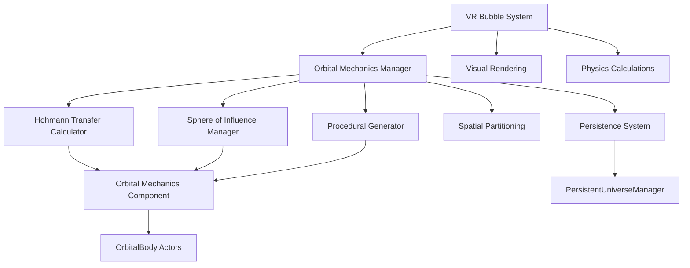

# Orbital Mechanics Manager - System Architecture

## Overview
The Orbital Mechanics Manager is a comprehensive system for realistic space navigation in VR, built around a revolutionary "bubble system" that projects astronomical scales into a localized space for optimal VR comfort and performance.

## Core Architecture

### 1. VR Bubble System (Foundation Layer)
The foundation of the entire system - a 100m radius bubble centered on the player's ship that uses inverse square scaling to project astronomical distances into a manageable VR space.

**Key Components:**
- `UVrBubbleComponent` - Manages the bubble projection system
- Inverse square scale projection for both visual and physics calculations
- Dynamic LOD system for objects outside the bubble
- Seamless transitions between bubble scales

**Mathematical Basis:**
```
ProjectedDistance = BubbleRadius × (1 - (1 / (1 + RealDistance²)))
ScaleFactor = ProjectedDistance / RealDistance
```

### 2. Orbital Mechanics Manager (Coordination Layer)
Central manager that coordinates all orbital mechanics calculations and integrates with the VR bubble system.

**Key Components:**
- `UOrbitalMechanicsManager` - Main subsystem
- Universe management and body registration
- Integration with PersistentUniverseManager
- Real-time orbital calculations using bubble-projected scales

### 3. Advanced Orbital Calculations
Enhanced orbital mechanics with support for realistic space flight.

**Key Components:**
- Enhanced `UOrbitalMechanics` component
- Keplerian orbital mechanics
- Elliptical orbit calculations
- Orbital period and anomaly conversions

### 4. Hohmann Transfer Calculator
Advanced transfer maneuver calculations for realistic space navigation.

**Key Components:**
- `UHohmannTransferCalculator`
- Standard Hohmann transfers
- Bi-elliptic transfers for large radius ratios
- Plane change maneuvers
- Transfer window calculations

### 5. Sphere of Influence Manager
Hierarchical gravitational system management using patched conics.

**Key Components:**
- `USphereOfInfluenceManager`
- Hierarchical SOI for planets, moons, stars
- Automatic SOI transitions
- Gravity assist mechanics

### 6. Procedural Star System Generator
Scientifically accurate star system generation.

**Key Components:**
- `UProceduralStarSystemGenerator`
- Realistic star generation (O, B, A, F, G, K, M classes)
- Habitable zone calculations
- Resource distribution based on system type

### 7. Spatial Partitioning Octree
Efficient management of thousands of orbital objects.

**Key Components:**
- `USpatialPartitioningOctree`
- LOD system for distant objects
- Query optimization for nearby objects
- Memory-efficient storage

### 8. Deep Space Persistence System
Navigation persistence for returning to deep space objects.

**Key Components:**
- Persistent orbital state storage
- Object rediscovery system
- Navigation waypoint system

## System Integration Flow



## VR Bubble System Details

### Bubble Projection Mathematics
The bubble system uses inverse square scaling to project astronomical distances:

1. **Distance Projection**: Real astronomical distances are projected into the bubble using inverse square
2. **Scale Factor**: Objects maintain relative proportions while fitting in VR space
3. **Physics Integration**: All physics calculations use the projected distances
4. **Visual Consistency**: Rendering and physics use the same scale system

### Bubble Hierarchy
```
Player Ship (Center)
    └── VR Bubble (100m radius)
        ├── Visual Projection Layer
        ├── Physics Calculation Layer
        └── LOD Management Layer
```

### Performance Optimization
- Objects outside bubble use aggressive LOD
- Physics calculations cull distant objects
- Spatial partitioning optimizes queries
- Inverse square scaling reduces precision requirements

## Implementation Phases

### Phase 1: VR Bubble System Foundation
- Create UVrBubbleComponent
- Implement inverse square projection
- Integrate with existing OrbitalBody system
- Basic physics using projected scales

### Phase 2: Core Orbital Mechanics
- Create OrbitalMechanicsManager
- Enhance OrbitalMechanics component
- Implement Keplerian calculations
- Basic orbital simulation

### Phase 3: Advanced Maneuvers
- HohmannTransferCalculator
- SphereOfInfluenceManager
- Transfer window calculations
- SOI transitions

### Phase 4: Procedural Generation
- Star system generator
- Realistic orbital parameters
- Habitable zone calculations
- Resource distribution

### Phase 5: Optimization & Persistence
- Spatial partitioning octree
- Deep space persistence
- Performance optimization
- Navigation system

## Key Features

### Realistic Orbital Mechanics
- Kepler's laws implementation
- Elliptical and circular orbits
- Orbital period calculations
- True/mean anomaly conversions

### Advanced Navigation
- Hohmann transfer orbits
- Bi-elliptic transfers
- Plane change maneuvers
- Gravity assists

### Scientific Accuracy
- Realistic star generation
- Proper orbital parameters
- Habitable zone calculations
- Astronomical scale preservation

### VR Optimization
- Inverse square projection
- Dynamic LOD system
- Performance scaling
- Comfort-focused design

### Persistence System
- Save orbital states
- Object rediscovery
- Navigation waypoints
- Return-to-object capability

## Integration with Existing Systems

### PersistentUniverseManager Integration
- Saves orbital parameters to database
- Loads systems from saved state
- Auto-saves orbital changes
- Bubble state persistence

### VR Interaction Integration
- Bubble-centered navigation
- Ship-scale bubble sizing
- VR comfort optimization
- Motion sickness prevention

### Performance Integration
- Spatial partitioning for queries
- LOD system for distant objects
- Physics culling outside bubble
- Memory-efficient storage

## Technical Requirements

### Performance Targets
- 1000+ orbital bodies at 60 FPS
- Real-time orbital calculations
- Smooth VR performance (90 FPS)
- < 10ms physics calculations

### Memory Usage
- < 100MB for 1000 bodies
- Efficient spatial partitioning
- Dynamic LOD memory scaling
- Compressed orbital data

### VR Comfort
- 100m bubble radius (optimal)
- Smooth scale transitions
- Motion sickness prevention
- Comfortable navigation speeds

## Future Enhancements

### Advanced Features
- N-body simulation option
- Relativistic effects
- Orbital perturbations
- Advanced transfer sequences

### VR Improvements
- Dynamic bubble sizing
- Multi-scale bubble system
- Enhanced visual effects
- Haptic feedback integration

### Gameplay Features
- Orbital construction
- Resource extraction
- Space station building
- Multiplayer orbital mechanics