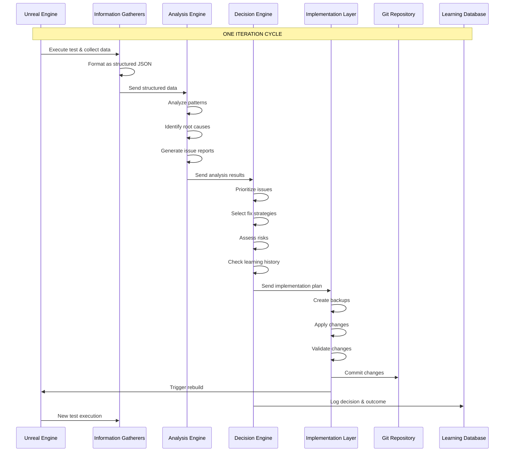

# Proper Autonomous Development Architecture
## Alexander VR Space Simulation - AI-Driven Development with Clear Separation of Concerns

**Version**: 1.0  
**Date**: November 11, 2025  
**Status**: Architecture Design  
**Core Principle**: Tests gather information → AI makes decisions → AI implements changes

---

## Executive Summary

This document defines the correct architecture where **tests are information gatherers only**, and **AI makes all decisions and implementations**. This eliminates the problematic pattern of tests trying to automatically fix issues.

### Key Principle
```
Tests → Information → AI Analysis → AI Decision → AI Implementation → Repeat
```

**NOT**
```
Tests → Try to Fix → Fail → Confusion
```

---

## 1. System Architecture

### 1.1 Four-Layer Architecture

```mermaid
graph TB
    subgraph Layer_1_Information_Gathering
        IG1[Compilation Error Collector]
        IG2[Runtime Log Collector]
        IG3[Performance Metrics Collector]
        IG4[Gameplay Data Collector]
        IG5[Asset Validation Collector]
        IG6[Visual State Collector]
    end
    
    subgraph Layer_2_Analysis_Engine
        AE1[Error Pattern Analyzer]
        AE2[Performance Bottleneck Detector]
        AE3[Gameplay Balance Analyzer]
        AE4[Code Quality Analyzer]
        AE5[Asset Issue Analyzer]
    end
    
    subgraph Layer_3_Decision_Engine
        DE1[Issue Prioritizer]
        DE2[Fix Strategy Selector]
        DE3[Risk Assessor]
        DE4[Learning Integrator]
    end
    
    subgraph Layer_4_Implementation
        IM1[C++ Code Modifier]
        IM2[Python Test Updater]
        IM3[Asset Creator/Fixer]
        IM4[Configuration Manager]
    end
    
    subgraph External_Systems
        UE[Unreal Engine]
        Git[Git Repository]
        DB[Learning Database]
    end
    
    UE --> IG1
    UE --> IG2
    UE --> IG3
    UE --> IG4
    UE --> IG5
    UE --> IG6
    
    IG1 --> AE1
    IG2 --> AE2
    IG3 --> AE2
    IG4 --> AE3
    IG5 --> AE5
    
    AE1 --> DE1
    AE2 --> DE1
    AE3 --> DE1
    AE4 --> DE1
    AE5 --> DE1
    
    DE1 --> DE2
    DE2 --> DE3
    DE3 --> DE4
    
    DE2 --> IM1
    DE2 --> IM2
    DE2 --> IM3
    DE2 --> IM4
    
    IM1 --> Git
    IM2 --> Git
    IM3 --> Git
    
    DE4 --> DB
    
    style UE fill:#333,stroke:#fff,stroke-width:2px
    style Git fill:#f44,stroke:#fff,stroke-width:2px
    style DB fill:#44f,stroke:#fff,stroke-width:2px
```



### 1.2 Data Flow



---

## 2. Layer 1: Information Gathering

### 2.1 Core Principle
**Tests do NOT make decisions or fixes. They ONLY collect data.**

### 2.2 Information Gatherers

#### 2.2.1 Compilation Error Collector
**Purpose**: Capture all compilation output from Unreal Build Tool

**What it does**:
- Runs build commands
- Captures stdout/stderr
- Parses errors and warnings
- Extracts file names, line numbers, error types
- **Does NOT attempt to fix anything**

**Output Format**:
```json
{
  "collector_type": "compilation_errors",
  "timestamp": "2025-11-11T17:58:00Z",
  "build_config": "Development",
  "results": {
    "success": false,
    "errors": [
      {
        "file": "Source/Alexander/Private/ShipSystem.cpp",
        "line": 45,
        "column": 12,
        "error_code": "C2065",
        "message": "undeclared identifier",
        "context": "ShipEngine->ApplyThrust()"
      }
    ],
    "warnings": [
      {
        "file": "Source/Alexander/Private/Planet.cpp",
        "line": 128,
        "warning_code": "C4996",
        "message": "deprecated function",
        "suggestion": "Use NewFunction() instead"
      }
    ],
    "total_errors": 1,
    "total_warnings": 1
  }
}
```

#### 2.2.2 Runtime Log Collector
**Purpose**: Capture Unreal Engine runtime logs during test execution

**What it does**:
- Executes game/tests in UE
- Captures log output
- Categorizes by severity (Error, Warning, Log)
- Extracts stack traces
- **Does NOT attempt to fix anything**

**Output Format**:
```json
{
  "collector_type": "runtime_logs",
  "timestamp": "2025-11-11T17:58:00Z",
  "test_scenario": "ship_movement_test",
  "results": {
    "errors": [
      {
        "time": "17:58:15.123",
        "category": "Physics",
        "message": "Attempting to move fully simulated skeletal mesh",
        "stack_trace": [
          "ShipComponent.cpp:234",
          "FlightController.cpp:89"
        ],
        "count": 5
      }
    ],
    "warnings": [
      {
        "time": "17:58:16.456",
        "category": "Blueprint",
        "message": "Accessed None trying to read property ShipEngine"
      }
    ],
    "logs": [
      {
        "time": "17:58:17.789",
        "category": "Game",
        "message": "Ship spawned successfully"
      }
    ]
  }
}
```

#### 2.2.3 Performance Metrics Collector
**Purpose**: Collect performance data during gameplay

**What it does**:
- Samples FPS, frame time, memory usage
- Captures performance spikes
- Identifies slow frames
- **Does NOT attempt to optimize anything**

**Output Format**:
```json
{
  "collector_type": "performance_metrics",
  "timestamp": "2025-11-11T17:58:00Z",
  "test_duration_seconds": 60.5,
  "results": {
    "fps": {
      "average": 58.3,
      "min": 12.1,
      "max": 62.0,
      "percentile_99": 45.2,
      "spike_frames": [
        {"frame": 1234, "fps": 12.1, "time": 20.5}
      ]
    },
    "frame_time_ms": {
      "average": 16.8,
      "min": 14.2,
      "max": 82.6,
      "budget_violations": 15
    },
    "memory_mb": {
      "current": 2456.8,
      "peak": 2891.2,
      "increase_rate_mb_per_sec": 12.3
    },
    "cpu_usage_percent": {
      "average": 45.2,
      "max": 78.9
    }
  }
}
```

#### 2.2.4 Gameplay Data Collector
**Purpose**: Collect gameplay metrics and player behavior

**What it does**:
- Tracks mission completion rates
- Records player actions
- Measures difficulty/balance metrics
- **Does NOT attempt to rebalance anything**

**Output Format**:
```json
{
  "collector_type": "gameplay_data",
  "timestamp": "2025-11-11T17:58:00Z",
  "scenario": "first_mission",
  "results": {
    "mission_completion_rate": 0.73,
    "average_completion_time_seconds": 452.3,
    "player_deaths": 12,
    "death_locations": [
      {"x": 1234, "y": 567, "z": 890, "cause": "collision"}
    ],
    "resource_collection": {
      "credits_earned_average": 1250,
      "fuel_consumed_average": 78.5
    },
    "difficulty_metrics": {
      "damage_taken_average": 45.2,
      "retry_count_average": 2.3
    }
  }
}
```

#### 2.2.5 Asset Validation Collector
**Purpose**: Check for missing or broken assets

**What it does**:
- Validates asset references
- Checks for missing textures/meshes
- Identifies broken Blueprint connections
- **Does NOT attempt to fix assets**

**Output Format**:
```json
{
  "collector_type": "asset_validation",
  "timestamp": "2025-11-11T17:58:00Z",
  "results": {
    "missing_assets": [
      {
        "reference_path": "/Game/Meshes/ShipHull",
        "referenced_by": [
          "BP_PlayerShip.abc",
          "BP_EnemyShip.def"
        ],
        "asset_type": "StaticMesh"
      }
    ],
    "broken_blueprints": [
      {
        "blueprint": "BP_MissionController",
        "issue": "Cast failed - target class not found",
        "node": "CastToMissionManager"
      }
    ],
    "unreferenced_assets": [
      {
        "path": "/Game/Textures/OldUI",
        "size_mb": 45.2,
        "last_used": "2025-09-15"
      }
    ]
  }
}
```

#### 2.2.6 Visual State Collector
**Purpose**: Capture screenshots and visual state

**What it does**:
- Takes screenshots at key moments
- Captures UI state
- Records visual regressions
- **Does NOT attempt to fix visual issues**

**Output Format**:
```json
{
  "collector_type": "visual_state",
  "timestamp": "2025-11-11T17:58:00Z",
  "results": {
    "screenshots": [
      {
        "path": "screenshots/test_001_main_menu.png",
        "resolution": "1920x1080",
        "capture_time": "17:58:20"
      }
    ],
    "ui_state": {
      "hud_elements_visible": 12,
      "menu_state": "main_menu",
      "fps_displayed": true
    },
    "visual_anomalies": [
      {
        "type": "texture_popin",
        "location": "ship_cockpit",
        "severity": "medium"
      }
    ]
  }
}
```

---

## 3. Layer 2: Analysis Engine

### 3.1 Core Principle
**Analyze gathered data to identify patterns and root causes. Do NOT make fix decisions.**

### 3.2 Analysis Components

#### 3.2.1 Error Pattern Analyzer
**Input**: Compilation errors, runtime logs  
**Output**: Categorized issues with severity

**What it does**:
- Groups similar errors
- Identifies root causes
- Calculates impact scope
- **Does NOT decide how to fix**

**Analysis Output**:
```json
{
  "analyzer": "error_pattern",
  "timestamp": "2025-11-11T17:58:00Z",
  "findings": [
    {
      "issue_id": "ERR-001",
      "type": "missing_include",
      "severity": "critical",
      "affected_files": ["ShipSystem.cpp", "FlightController.cpp"],
      "root_cause": "Header file 'ShipEngine.h' not included",
      "impact": "Compilation failure - 3 modules affected",
      "pattern_frequency": 5,
      "confidence": 0.95
    }
  ]
}
```

#### 3.2.2 Performance Bottleneck Detector
**Input**: Performance metrics  
**Output**: Identified bottlenecks with analysis

**What it does**:
- Analyzes frame time spikes
- Identifies memory leaks
- Finds CPU hotspots
- **Does NOT decide how to optimize**

**Analysis Output**:
```json
{
  "analyzer": "performance_bottleneck",
  "timestamp": "2025-11-11T17:58:00Z",
  "findings": [
    {
      "issue_id": "PERF-001",
      "type": "memory_leak",
      "severity": "high",
      "location": "ShipCustomizationComponent",
      "evidence": "Memory increasing at 12.3 MB/sec during ship spawning",
      "impact": "Game will crash after ~30 minutes",
      "confidence": 0.88
    }
  ]
}
```

#### 3.2.3 Gameplay Balance Analyzer
**Input**: Gameplay data  
**Output**: Balance issues and trends

**What it does**:
- Analyzes difficulty curves
- Identifies unfair mechanics
- Tracks player progression
- **Does NOT decide how to rebalance**

**Analysis Output**:
```json
{
  "analyzer": "gameplay_balance",
  "timestamp": "2025-11-11T17:58:00Z",
  "findings": [
    {
      "issue_id": "BAL-001",
      "type": "difficulty_spike",
      "severity": "medium",
      "location": "Mission_3_BossFight",
      "evidence": "73% completion rate, 2.3 retries average, 45.2 damage taken",
      "analysis": "Damage taken is 3x higher than previous missions",
      "confidence": 0.82
    }
  ]
}
```

---

## 4. Layer 3: Decision Engine

### 4.1 Core Principle
**Make intelligent decisions about WHAT to fix and HOW to fix it based on analysis.**

### 4.2 Decision Process

#### 4.2.1 Issue Prioritization
**Scoring Formula**:
```
Priority Score = (Severity × Impact × Confidence) / (Effort × Risk)
```

**Severity Weights**:
- Critical: 10 (blocks compilation/launch)
- High: 7 (major gameplay issues)
- Medium: 4 (minor bugs/balance)
- Low: 2 (cosmetic/optimization)

**Impact**: Number of affected systems/players  
**Confidence**: Analysis confidence (0.0-1.0)  
**Effort**: Estimated fix time (1-10 scale)  
**Risk**: Chance of breaking something (0.0-1.0)

#### 4.2.2 Fix Strategy Selection

**Decision Matrix**:

| Issue Type | Auto-Fix | Assisted | Human Approval | Examples |
|------------|----------|----------|----------------|----------|
| **Missing Include** | ✅ | - | - | Add `#include "Header.h"` |
| **Deprecated API** | ✅ | - | - | Replace `OldFunc()` with `NewFunc()` |
| **Simple Syntax** | ✅ | - | - | Add missing semicolon, fix bracket |
| **Test Assertion** | ✅ | - | - | Update expected value |
| **Memory Leak** | - | ✅ | - | Add `delete` or smart pointer |
| **Logic Bug** | - | ✅ | - | Fix algorithm, add bounds check |
| **Balance Tweak** | - | ✅ | - | Adjust damage/health values |
| **Asset Missing** | - | ✅ | - | Create placeholder or find replacement |
| **Architecture Change** | - | - | ✅ | Refactor class hierarchy |
| **API Breaking** | - | - | ✅ | Change function signatures |
| **Deployment** | - | - | ✅ | Production releases |

#### 4.2.3 Decision Output

```json
{
  "decision_engine": "v1.0",
  "timestamp": "2025-11-11T17:58:00Z",
  "decisions": [
    {
      "decision_id": "DEC-001",
      "issue_id": "ERR-001",
      "priority_score": 95.2,
      "rank": 1,
      "decision": "auto_fix",
      "fix_type": "add_include",
      "file": "Source/Alexander/Private/ShipSystem.cpp",
      "line": 1,
      "action": "Add '#include \"ShipEngine.h\"' after existing includes",
      "estimated_effort_minutes": 2,
      "risk_score": 0.05,
      "confidence": 0.95,
      "requires_approval": false,
      "rollback_plan": "Remove the added include line"
    },
    {
      "decision_id": "DEC-002",
      "issue_id": "PERF-001",
      "priority_score": 78.4,
      "rank": 2,
      "decision": "assisted_fix",
      "fix_type": "memory_management",
      "file": "Source/Alexander/Private/ShipCustomizationComponent.cpp",
      "line": 234,
      "action": "Convert raw pointer to TUniquePtr",
      "estimated_effort_minutes": 15,
      "risk_score": 0.25,
      "confidence": 0.88,
      "requires_approval": false,
      "human_review_recommended": true,
      "rollback_plan": "Revert to previous commit"
    }
  ],
  "deferred_issues": [
    {
      "issue_id": "BAL-001",
      "reason": "Lower priority, requires gameplay testing",
      "defer_until": "next_playtest_session"
    }
  ]
}
```

---

## 5. Layer 4: Implementation

### 5.1 Core Principle
**Execute the decisions made by the Decision Engine. Do NOT make new decisions.**

### 5.2 Implementation Components

#### 5.2.1 C++ Code Modifier
**Input**: Decision to modify C++ code  
**Output**: Modified code files + git commit

**What it does**:
- Creates backup of original file
- Applies code changes using AST or regex
- Validates compilation
- Commits to git
- **Only implements what Decision Engine specified**

**Implementation Log**:
```json
{
  "implementation_id": "IMP-001",
  "decision_id": "DEC-001",
  "type": "cpp_modification",
  "timestamp": "2025-11-11T17:58:00Z",
  "file": "Source/Alexander/Private/ShipSystem.cpp",
  "action_taken": "Added '#include \"ShipEngine.h\"' at line 3",
  "backup_created": "backups/ShipSystem.cpp.bak.20251111_175800",
  "validation": {
    "compilation_attempted": true,
    "compilation_successful": true,
    "errors_remaining": 0
  },
  "git_commit": "abc123def456",
  "status": "completed"
}
```

#### 5.2.2 Python Test Updater
**Input**: Decision to update test expectations  
**Output**: Updated test files + git commit

**What it does**:
- Updates test assertions
- Fixes mock objects
- Updates test data
- **Only implements what Decision Engine specified**

#### 5.2.3 Asset Creator/Fixer
**Input**: Decision to create or fix assets  
**Output**: New/modified assets + git commit

**What it does**:
- Creates placeholder assets
- Fixes broken references
- Reimports assets
- **Only implements what Decision Engine specified**

#### 5.2.4 Configuration Manager
**Input**: Decision to update config  
**Output**: Modified config files + git commit

**What it does**:
- Updates INI files
- Modifies project settings
- Adjusts gameplay values
- **Only implements what Decision Engine specified**

---

## 6. Learning System

### 6.1 Purpose
Track success/failure of decisions to improve future decision-making.

### 6.2 What is Logged

```json
{
  "learning_record": {
    "timestamp": "2025-11-11T17:58:00Z",
    "decision_id": "DEC-001",
    "issue_type": "missing_include",
    "fix_type": "add_include",
    "files_modified": ["ShipSystem.cpp"],
    "outcome": {
      "compilation_fixed": true,
      "tests_passed": true,
      "performance_impact": "none",
      "new_issues_introduced": 0
    },
    "success": true,
    "time_to_fix_minutes": 3.2
  }
}
```

### 6.3 How it Improves Decisions

- **Success Rate Tracking**: Which fix types work best for each issue type
- **Risk Assessment**: Historical data on what breaks things
- **Effort Estimation**: Actual vs estimated fix times
- **Confidence Scoring**: Adjust confidence based on past performance

---

## 7. Safety Mechanisms

### 7.1 Backup System
- Create file backups before any modification
- Store backups with timestamps
- Retain last 10 backups per file

### 7.2 Rollback Capability
- Automatic rollback if:
  - Compilation fails after changes
  - Test pass rate drops >10%
  - Performance degrades >15%
  - New critical errors introduced
- One-click manual rollback
- Git revert capability

### 7.3 Human Approval Gates
**Require approval for**:
- Changes to Public header files
- API signature modifications
- Deletion of assets or code files
- Configuration changes affecting gameplay
- Changes to core engine integration
- Any change with risk_score > 0.7

### 7.4 Resource Limits
- Max execution time: 30 minutes per iteration
- Max memory usage: 8GB
- Max disk usage: 10GB for temp files
- Max changes per iteration: 50 lines of code

---

## 8. Main Orchestrator

### 8.1 Workflow Loop

```python
class AutonomousDevelopmentOrchestrator:
    def run_development_iteration(self):
        """Main development loop - tests gather info, AI makes decisions"""
        
        while True:
            # 1. INFORMATION GATHERING
            print("🔍 Gathering information from Unreal Engine...")
            
            compilation_data = CompilationErrorCollector().run()
            runtime_data = RuntimeLogCollector().run()
            performance_data = PerformanceMetricsCollector().run()
            gameplay_data = GameplayDataCollector().run()
            asset_data = AssetValidationCollector().run()
            
            # 2. ANALYSIS
            print("🧠 Analyzing gathered information...")
            
            analysis_results = AnalysisEngine().analyze(
                compilation_data,
                runtime_data,
                performance_data,
                gameplay_data,
                asset_data
            )
            
            # 3. DECISION MAKING
            print("🤔 Making decisions based on analysis...")
            
            decisions = DecisionEngine().make_decisions(analysis_results)
            
            if not decisions:
                print("✅ No issues found - exiting")
                break
            
            # 4. HUMAN APPROVAL (if needed)
            if decisions.require_approval():
                print("⚠️  Some decisions require human approval")
                approved = self.get_human_approval(decisions)
                if not approved:
                    print("❌ Human rejected decisions - exiting")
                    break
            
            # 5. IMPLEMENTATION
            print("🔧 Implementing approved decisions...")
            
            implementation_results = ImplementationLayer().execute(decisions)
            
            # 6. LEARNING
            print("📚 Learning from results...")
            
            LearningSystem().log_results(decisions, implementation_results)
            
            # 7. VERIFICATION
            print("🧪 Verifying fixes...")
            
            if self.verify_fixes(implementation_results):
                print("✅ Fixes verified successfully")
                break
            else:
                print("⚠️  Issues remain - starting next iteration")
                continue
```

### 8.2 Exit Conditions
- All tests pass
- No new issues found
- Max iterations reached (default: 10)
- Human abort
- Critical failure requiring manual intervention

---

## 9. First Working Example: Compilation Error Fix Loop

### 9.1 Scenario
Missing header file causes compilation failure.

### 9.2 Step-by-Step Execution

**Iteration 1**:
1. **Test runs**: Build fails with error
2. **Information Gathered**: 
   ```
   Error: C2065 'ShipEngine': undeclared identifier
   File: ShipSystem.cpp:45
   ```
3. **Analysis**: Missing include for ShipEngine.h
4. **Decision**: Add `#include "ShipEngine.h"` to ShipSystem.cpp
5. **Implementation**: AI adds the include line
6. **Verification**: Build succeeds

**Result**: Fixed in 1 iteration, 3 minutes total

---

## 10. Success Metrics

### 10.1 System Effectiveness
- **Issue Detection Rate**: % of issues correctly identified
- **Fix Success Rate**: % of fixes that resolve issues
- **False Positive Rate**: % of unnecessary changes
- **Average Iterations**: Number of loops to fix issues

### 10.2 Development Velocity
- **Time to Fix**: Average time from detection to resolution
- **Human Hours Saved**: Compared to manual fixing
- **Autonomous Completion Rate**: % of issues fixed without human intervention

### 10.3 Quality Metrics
- **No Regression Rate**: % of fixes that don't break existing functionality
- **Performance Impact**: Change in FPS/memory after fixes
- **Test Pass Rate**: Maintained or improved test success rates

---

## 11. Implementation Roadmap

### Phase 1: Foundation (Week 1)
- [ ] Create Information Gathering Layer for compilation errors
- [ ] Create basic Analysis Engine for error categorization
- [ ] Create Decision Engine with simple rules
- [ ] Create C++ Implementation Layer for missing includes
- [ ] Create main orchestrator loop
- [ ] Test with simple compilation error scenario

### Phase 2: Expansion (Week 2)
- [ ] Add Runtime Log Collector
- [ ] Enhance Analysis Engine with pattern recognition
- [ ] Add Python Test Implementation Layer
- [ ] Add Learning System basics
- [ ] Test with runtime error scenario

### Phase 3: Intelligence (Week 3)
- [ ] Add Performance Metrics Collector
- [ ] Add Gameplay Data Collector
- [ ] Enhance Decision Engine with scoring system
- [ ] Add Asset Implementation Layer
- [ ] Create Monitoring Dashboard
- [ ] Test with performance issue scenario

### Phase 4: Production (Week 4)
- [ ] Add all remaining collectors
- [ ] Implement safety mechanisms
- [ ] Add human approval gates
- [ ] Comprehensive testing
- [ ] Documentation

---

## 12. Key Files to Create

```
autonomous_development/
├── information_gatherers/
│   ├── compilation_error_collector.py
│   ├── runtime_log_collector.py
│   ├── performance_metrics_collector.py
│   ├── gameplay_data_collector.py
│   ├── asset_validation_collector.py
│   └── visual_state_collector.py
├── analysis_engine.py
├── decision_engine.py
├── implementation_layer/
│   ├── cpp_code_modifier.py
│   ├── python_test_updater.py
│   ├── asset_creator.py
│   └── configuration_manager.py
├── learning_system.py
├── monitoring_dashboard.py
├── safety_validator.py
├── autonomous_orchestrator.py
└── schemas/
    ├── information_schema.json
    ├── analysis_schema.json
    ├── decision_schema.json
    └── implementation_schema.json
```

---

## 13. Conclusion

This architecture ensures **clear separation of concerns**:
- **Tests** only gather information
- **AI** makes all decisions  
- **AI** implements all changes
- **Learning** improves future decisions

This eliminates the problematic pattern of tests trying to fix issues and creates a sustainable, improvable autonomous development system.

**Next Step**: Begin Phase 1 implementation with compilation error detection and fixing.