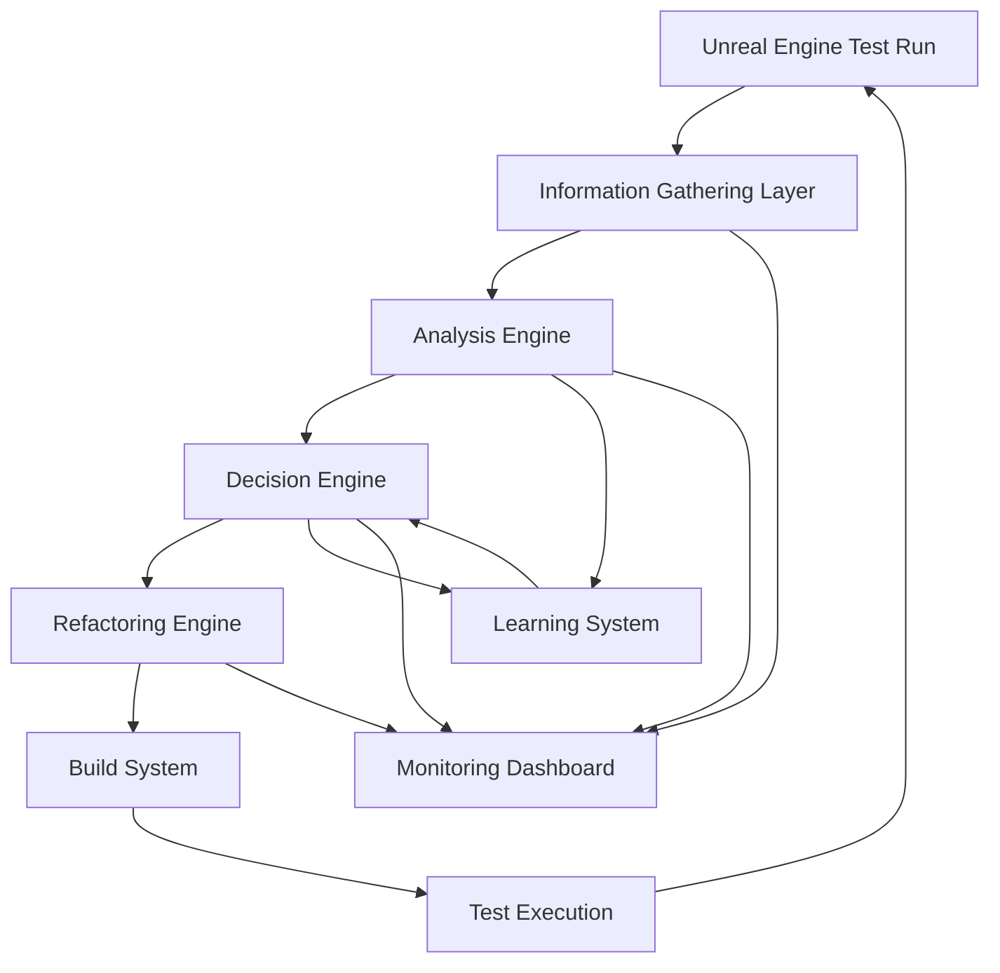
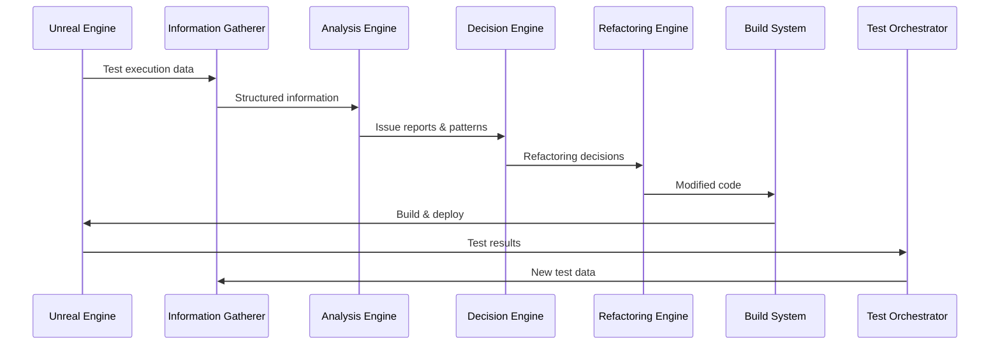

# Autonomous Refactoring System Architecture
## Alexander VR Space Simulation - AI-Driven Development

### Overview
An autonomous system that gathers information from Unreal Engine during test execution, analyzes code and runtime issues, makes intelligent refactoring decisions, automatically modifies both C++ project code and Python test code, rebuilds the project, and iteratively runs tests until issues are resolved.

### System Architecture

### Component Details

#### 1. Information Gathering Layer
**Purpose**: Collect comprehensive data from Unreal Engine during test execution

**Data Sources**:
- **Compilation Output**: Errors, warnings, include issues, linker problems
- **Runtime Logs**: Error messages, stack traces, assertions, warnings
- **Performance Metrics**: FPS, memory usage, CPU utilization, frame time
- **Gameplay Data**: Mission completion rates, player behavior, balance metrics
- **Test Results**: Pass/fail status, execution time, error messages
- **Asset Validation**: Missing assets, broken references, load failures

**Implementation**: `information_gatherer.py`
- Connects to Unreal Engine via HTTP API and log parsing
- Real-time data collection during test execution
- Stores data in structured format (JSON) for analysis

#### 2. Analysis Engine
**Purpose**: Process gathered information to identify patterns and root causes

**Analysis Types**:
- **Error Pattern Recognition**: Categorize compilation/runtime errors
- **Performance Bottleneck Detection**: Identify slow functions, memory leaks
- **Code Quality Analysis**: Find code smells, anti-patterns, duplication
- **Test Failure Analysis**: Determine if failure is due to test code or project code
- **Asset Issue Detection**: Identify missing or broken assets
- **Gameplay Balance Analysis**: Detect imbalances in missions, economy, difficulty

**Implementation**: `analysis_engine.py`
- Machine learning models for pattern recognition
- Rule-based analysis for known issues
- Statistical analysis for performance data
- Generates structured issue reports with severity levels

#### 3. Decision Engine
**Purpose**: Prioritize issues and determine optimal refactoring strategies

**Decision Factors**:
- **Impact**: How many tests/features are affected
- **Effort**: Estimated time/complexity to fix
- **Risk**: Likelihood of introducing new issues
- **Learning**: Historical success rates of similar fixes
- **Dependencies**: Order in which issues should be addressed

**Decision Types**:
- **Fix C++ Code**: Modify project source code
- **Fix Python Tests**: Update test scripts
- **Fix Assets**: Create or modify content
- **Fix Configuration**: Update settings/config files
- **Skip/Defer**: Low priority or high-risk issues

**Implementation**: `decision_engine.py`
- Weighted scoring system for issue prioritization
- Decision tree based on issue type and context
- Integration with learning system for improved decisions
- Generates refactoring plan with specific actions

#### 4. Refactoring Engine
**Purpose**: Automatically modify code based on decisions

**C++ Refactoring Capabilities**:
- **Include Fixes**: Add missing #include statements
- **Syntax Corrections**: Fix common syntax errors
- **API Updates**: Update deprecated function calls
- **Memory Management**: Fix leaks and dangling pointers
- **Performance Optimizations**: Apply known optimization patterns
- **Code Organization**: Move functions to appropriate files

**Python Refactoring Capabilities**:
- **Test Updates**: Fix broken test assertions
- **Mock Updates**: Update mocks when interfaces change
- **Import Fixes**: Add missing imports
- **Configuration Updates**: Adjust test parameters

**Safety Mechanisms**:
- **Backup Creation**: Save original files before modification
- **Change Validation**: Verify modifications compile before applying
- **Rollback Capability**: Revert changes if tests still fail
- **Human Review Gate**: Complex changes require approval

**Implementation**: `refactoring_engine.py`
- AST (Abstract Syntax Tree) manipulation for C++
- Regex and parsing for Python
- Template-based code generation
- Integration with version control

#### 5. Build System Integration
**Purpose**: Automated compilation and linking

**Features**:
- **Incremental Builds**: Only rebuild affected modules
- **Parallel Compilation**: Utilize multiple cores
- **Error Recovery**: Retry with different flags if build fails
- **Build Caching**: Cache successful builds for speed

**Implementation**: `build_orchestrator.py`
- Wraps Unreal Build Tool (UBT)
- Monitors compilation progress
- Captures and parses build output
- Integration with refactoring engine for iterative builds

#### 6. Test Orchestration
**Purpose**: Continuous test execution loop

**Workflow**:
1. Run tests with current code
2. Gather information from test execution
3. If tests pass → Exit success
4. If tests fail → Analyze → Decide → Refactor → Rebuild → Repeat

**Features**:
- **Test Selection**: Run only relevant tests based on changes
- **Timeout Handling**: Kill hung tests
- **Result Aggregation**: Collect results across multiple runs
- **Progress Tracking**: Monitor improvement over iterations

**Implementation**: `test_orchestrator.py`
- Manages test execution lifecycle
- Coordinates with other components
- Implements retry logic with exponential backoff
- Generates comprehensive reports

#### 7. Learning System
**Purpose**: Improve decision-making based on historical data

**Learning Mechanisms**:
- **Success Tracking**: Which refactoring strategies work best
- **Failure Analysis**: Why certain fixes didn't work
- **Pattern Recognition**: Identify recurring issues and their solutions
- **Performance Prediction**: Estimate fix effectiveness

**Implementation**: `learning_system.py`
- Database of past refactoring attempts
- ML models trained on historical data
- Continuous model updates based on results
- Provides confidence scores for decisions

#### 8. Monitoring Dashboard
**Purpose**: Real-time visibility into system operation

**Features**:
- **Current Status**: What issue is being addressed
- **Progress Metrics**: Tests passing, issues resolved
- **Decision Log**: Why each refactoring decision was made
- **Performance Charts**: Build times, test execution, resource usage
- **Alert System**: Notify on critical issues or stuck processes

**Implementation**: `dashboard.py` (web-based)
- Real-time WebSocket updates
- Historical data visualization
- Export capabilities for reports
- Mobile-responsive design

### Data Flow

### Implementation Phases

#### Phase 1: Foundation (Current)
- ✅ Information gathering from Unreal Engine
- ✅ Basic analysis of compilation errors
- ✅ Simple decision logic
- ✅ Manual refactoring triggers

#### Phase 2: Automation Core
- 🔄 Automated C++ refactoring for common issues
- 🔄 Python test code refactoring
- 🔄 Build system integration
- 🔄 Basic learning system

#### Phase 3: Intelligence
- ⏳ Advanced pattern recognition
- ⏳ Performance optimization suggestions
- ⏳ Gameplay balance analysis
- ⏳ Sophisticated decision engine

#### Phase 4: Full Autonomy
- ⏳ End-to-end autonomous operation
- ⏳ Complex refactoring capabilities
- ⏳ Self-improvement mechanisms
- ⏳ Comprehensive monitoring

### Key Files to Create

1. `information_gatherer.py` - Data collection from UE
2. `analysis_engine.py` - Issue identification
3. `decision_engine.py` - Refactoring decisions
4. `refactoring_engine.py` - Code modification
5. `build_orchestrator.py` - Automated builds
6. `test_orchestrator.py` - Test execution loop
7. `learning_system.py` - Improvement over time
8. `dashboard.py` - Monitoring interface
9. `autonomous_refactoring.py` - Main orchestrator

### Safety & Control

- **Human Oversight**: Critical changes require approval
- **Change Limits**: Maximum lines modified per iteration
- **Rollback**: Automatic revert if tests don't improve
- **Emergency Stop**: Halt system if issues arise
- **Logging**: Comprehensive audit trail of all changes

### Success Metrics

- **Issue Resolution Rate**: % of issues automatically fixed
- **Test Pass Rate**: Improvement in test success over iterations
- **Build Success Rate**: Reduction in compilation errors
- **Performance Improvement**: FPS, memory usage improvements
- **Time to Fix**: Average time from issue detection to resolution
- **Human Effort Reduction**: Hours saved vs manual fixing